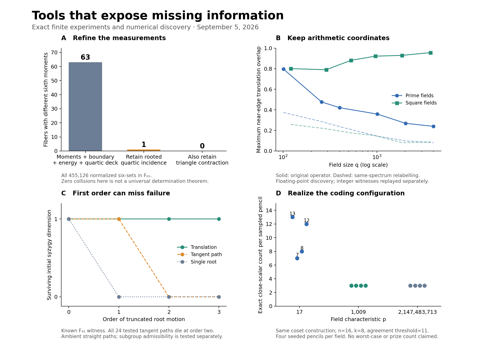

# Mathematical tooling lab: Paley and proximity

**Research and executable prototypes, September 5–6, 2026.** This project investigates missing mathematical information and how to detect it. It attempts neither prize proof. The first three tool families below were implemented, tested against controls, and revised after their first interpretations failed.

**Second iteration: [exact energies and agreement censuses](round2/README.md).** It adds exact all-input harmonic energies beyond field enumeration, a complete compressed agreement census, domain-preserving arithmetic lifts, and exact million-prime spectral witnesses. The new critical-size tests weaken the toy triangle's predictive interpretation; the exact toy separation remains valid.

**Further iteration: [counterfactual tests](round3/README.md).** An exact Paley/Peisert comparison demonstrates information lost by the new global-energy compiler; a phase-sensitive prototype rejects generic summaries after stronger symmetry and chirp controls. These sharpen what the next tools must retain.

**Fourth iteration: [marked contractions and certified batches](round4/README.md).** Exact arithmetic conditioning isolates one missing contraction, verifies actual equal-cell witnesses, and scales its computation to a million-point field. A norm envelope also exposes its small effect on the tested conditional averages. Coding experiments certify large interpolation families and then refine an interleaved failure with complete scalar-fiber certificates.

**Fifth iteration: [seven trace statistics and discovered polynomial pieces](round5/README.md).** The generic global third-moment compiler now works beyond six-column sets and reduces to seven measured statistics and15 coefficient evaluations. Independent complete censuses reach450,978,066 eight-sets per order49 graph. Blind polynomial reconstruction supplies previously missing coding witnesses at n1024. The final integration audit pins113 artifacts and407 source/input bindings, with round4 preserved.

**Sixth iteration: [exact information limits and changed certificates](round6/README.md).** Exact critical-size algebra explains the global third moment's small arithmetic sensitivity, with inventory-free enclosures at two-billion-point scale. Every partition certificate fails on16 hard pencils; overlapping covers certify two of them with118 and49 tracks. Integration pins94 artifacts and338 source/input bindings and preserves all113 round5 artifacts.

**Seventh iteration: [exact local fluctuations](round7/README.md).** Two independent arithmetic implementations calculate complete one-swap moments through q=6,700,417,n=50, covering335 million neighbours per input. Actual seven- and eight-point witnesses defeat the full row histogram plus unordered quartic deck. A further orbit audit exposes summary saturation and two pairs with identical complete one-swap distributions. Integration pins35 artifacts and127 source/input bindings, with round6 preserved.

**Eighth iteration: [covariance of edits sharing an insertion](round8/README.md).** The new derivative-Gram compiler separates non-affine inputs with identical complete edit marginals, even after removing the common deletion mode. It scales through q=6,700,417,n=50, with exact fractions, a reusable query command, and explicit full-versus-sampled verification coverage. A separate independent-sign calculation prevents mistaking common response for special arithmetic structure.

**Ninth iteration: [actual two-insertion outcomes](round9/README.md).** Exact fixed-deletion-pair moments cover 22.4 trillion possible final sets per largest query. A separate implementation reconstructs the global contraction exactly. The saved twins have different second-neighbourhood distributions but equal global variances; retaining the deletion pair exposes differences already in the mean. The coding audit detects a precise overlapping-block scope failure in a printed lemma, with a passing disjoint-block control.

**Tenth iteration: [all pair means and an information audit](round10/README.md).** The compiler computes all 1,225 deletion-pair means together at q=6,700,417, with every entry independently verified. Its symbolic reduction shows why the apparent new invariant is largely existing target incidence: six- and seven-point projected means require only quartic incidence and the induced graph, while the eight-point toy summary identifies every affine orbit.

**Eleventh iteration: [pinning probabilities and an information obstruction](round11/README.md).** The rank-two polynomial query reaches length 1,024 with independent exact optimization. Two rank-three polynomial spaces share Tutte polynomials, codeword weight distributions and first two pinning moments, yet have different worst pinning counts. The checkpoint binds 49 artifacts and 86 source/input bindings.

**Twelfth iteration: [multiplicities, full-length certificates and actual pruning](round12/README.md).** The query now handles all 2,894 actual rank-three spaces, including zero and parallel columns. Standalone certificates reach n1024, and actual sampled pruning passes complete output oracles and independent Gaussian replay. The checkpoint binds 42 artifacts and 103 source/input bindings.

**Thirteenth iteration: [deterministic coordinate-query covers](round13/README.md).** Ten triples cover the hard small space and 2,070 cover the saved n1024 space. All 2,894 actual small spaces have checked 10–16-query covers, tested against 12,640,992 eleven-subsets. The checkpoint binds 25 artifacts and 78 source/input bindings.

**Fourteenth iteration: [agreement bounds from complete query transcripts](round14/README.md).** Query occurrence recovers local support; absence supplies agreement caps. The general-dimensional pruner is independently checked on 419,998 queries and 362,993,184 candidate-coordinate values, including supplied spaces below the ambient Johnson threshold. Large coordinate-evaluation reductions coexist with a1,008-test late-rejection witness. Integration binds 80 artifacts and 198 source/input bindings.

**Fifteenth iteration: [projective capacities and local repair](round15/README.md).** A 62-coordinate projective class makes the cheapest unconstrained allocation impossible. Capacity-aware packing attains a verified 136,155-query optimum within complete-arc block partitions; two local swaps repair its first allocation. Three boundary decoding tests independently check 408,465 queries and 418,151,424 candidate-coordinate values. Integration binds 34 artifacts and 123 source/input bindings.

**Sixteenth iteration: [conditional decoding and early rejection](round16/README.md).** Received-word frequencies reduce dimension and cut query counts, but actual decoding exposes a verification regression. Reserving singleton tests repairs it: the revised three cases use 71,520–73,554 queries and 72,345–76,276 coordinate evaluations, with unchanged complete supplied-space lists. Separate reviews check 429,712 query solutions and 413,235,758 candidate-coordinate values across both designs.

**Seventeenth iteration: [carries, compression and exact digit realizability](round17/README.md).** Small-digit encodings retain arithmetic norm information through a two-billion-point prime. An inverse checker exposes6304 impossible words in the small ternary cube; even an oracle for actual norm-energy pairs admits688 of them. Separate resultants check the entire6561-word census.

**Eighteenth iteration: [an exact digit language for the generator-2 section](round18/README.md).** Alternating signs, the endpoint and a cofactor congruence give a compact membership interface. A transfer counter agrees with direct enumeration of all6700417 scalars at the largest tested prime. Exactly512 nonzero words attain minimum digit support five, but their norm defects range from449 to84481. Signed-permutation adapters cover451 saved encodings.

**Nineteenth iteration: [general membership beyond short-relation bounds](round19/README.md).** A one-unit centering error passes every relation-derived digit bound up to coefficient sum11607941 at the general two-billion-point prime. Modular scalar extraction followed by exact re-encoding rejects it and handles all saved general encodings, with a fallback for degenerate calibration. Separate checks cover the6561-word census, hard arithmetic witnesses,204 degeneracy records, and117200 additional digit words across80 small relations.

**Twentieth iteration: [complete digit families and certified state requirements](round20/README.md).** Reordering the saved65537-word encoding reduces its exact peak width from1597 to5. A symbolic diagram represents all6700417 scalar words and answers arbitrary-coordinate completion queries. Independent arithmetic checks524288 cross-splices; nine adaptive suffixes repair ten missed residual distinctions in a smaller complete control.

**Twenty-first iteration: [exact erasure decoding through a scalar quotient](round21/README.md).** Centered-coordinate cancellation reduces the general two-billion-point input's32-erasure candidate cap from110612791296 to41472, with unique recovery for any20 consecutive cyclic erasures. One rational certificate and an independent100000-scalar census imply a100000-state finite lower bound without quadratic splice tests. Alternating/random erasure geometries still exceed the work limit.

**Twenty-second iteration: [known-digit equations and coupled difference certificates](round22/README.md).** A changed lattice metric and exact conditioning lower the consecutive32-erasure decoder cap to512. Individual optimal bounds still leave9841 nonzero difference directions up to sign;156 pair cuts reduce these to86, and86 exact separators exclude the remainder. Independent review certifies unique completion after any32 consecutive cyclic erasures on the saved general input. All5206 actual shared-known pairs in eight small controls are checked, preserving genuine ambiguities.

**Newest completed iteration: [compressed covers and actual orbit intersections](round23/README.md).** An exact tree covers3690562 nonzero difference representatives with1867 nodes and64 cuts, proving unique completion after any36 consecutive cyclic erasures. A40-erasure integer-lattice candidate satisfies the geometric checks but has no actual scalar pair: two implementations exhaust27904523 candidates and return zero. The new gap identifies joint orbit realizability as missing information. Scattered erasures and the remaining40-erasure regions stay open; the [next iteration](NEXT_ITERATION.md) will compile direct inverse-coordinate cuts and richer orbit certificates.

The strongest result is a practical change in research method: ask **what information a proposed argument has discarded**, produce an exact witness of that loss on actual arithmetic inputs, and refine the representation before attempting an estimate. That general strategy has prior art. The potentially original work here is its precise arithmetic implementation and the resulting finite witnesses; historical novelty is not established.



## Start here

| Tool | What it now does | Concrete result | Detail |
|---|---|---|---|
| Exact observable and realization auditor | Finds actual character sets with equal selected measurements and different target moments; extracts integer moment-preserving moves; adds incidence information. | At p=61, flat measurements leave 63 ambiguous fibers. Rooted quartic incidence leaves one. A triangle contraction of the already computed quartics resolves the remaining finite ambiguity. | [Observables](observables/README.md) |
| Spectral witness transport microscope | Searches the complete near-edge subspace, attaches an arithmetic translation signature, and exports integer witnesses. | All six square-field controls recover their subfield mechanism. An exact prime-field witness rejects an overstrong pointwise explanation of outliers. Affine controls expose and repair a coordinate dependence. | [Spectral](spectral/README.md) |
| Syzygy and realized-stack microscope | Tracks dependencies through root-motion orders, separates admissible subgroup edits, and retains actual decoded-codeword/track overlap. | First-order preservation hides second-order failure in the F41 example. Equal coset diagnostics coexist with different realized scalar counts. Extension-field checks find a bad scalar outside the prime subfield. | [Proximity](proximity/README.md) |

The [prior-art audit](novelty/README.md) and [primary-source/query ledger](novelty/literature_ledger.md) distinguish known mechanisms, local earlier attempts, and proposed combinations. The research question is broader than finding a new name for an open bound.

## What the existing record actually supports

The live Paley frontier has four distinct gaps: uniform signed moments; exceptional subgroup relations and energies; the full localized spectral edge including invisible sectors and borders; and scalar code maxima plus the separate official spot-check obligation. Previous local passes include substantial identities and finite obstructions. Their unresolved analytic inputs are not supplied by those identities.

The proximity audit uncovered a material correction to older proposal documents: the inspected record does not establish that *every* prize solution must imply the proposed Paley-style Fourier estimate. The current [necessity audit](/Users/shawwalters/proximityprize/docs/kb/deltastar-sw1-nec-2026-09-05.md) distinguishes conditional Fourier-to-incidence routes from an actual necessity theorem. Thus a direct coding route remains a separate possibility. This lab does not independently rebuild its referenced Lean cone.

Earlier local work already proposed cumulants, R-transforms, antipodal matroids, Koszul complexes, phase operators, gauge fixing and conductor gradings. Several had later negative audits. Generic use of those subjects would not meet the requested novelty standard. Nor is the classical toolbox proved exhausted.

## The most promising new research object

For a class of actual arithmetic inputs X, a target T and a measurement map f, define the finite realization envelope

```
R_f(u) = { T(x) : x in X and f(x)=u }.
```

Compare it with an explicitly larger, algebraically tractable relaxation. The **realization gap** measures what the relaxation permits that actual field inputs cannot achieve. A candidate tool should preserve enough arithmetic incidence to reduce that gap without reproducing the entire input or disguising T as a feature.

In the six-column experiment, the relaxed histogram fiber has one primitive direction `(-10,15,-6,1)` on absolute row sums `{0,2,4,6}`. Each step preserves moments through four and changes M6 by exactly 23,040. The exact p=61 census shows that 205 of 257 lower/boundary fibers have a smaller realizable upper endpoint than their nonnegative histogram relaxation. This supplies a concrete laboratory for learning what arithmetic realizability imposes beyond moment identities.

The important follow-up came from a failure: an unordered list of all quartic correlations still loses information. Attaching those same correlations to their omitted column pairs gives a weighted graph. Its incidence signatures and triangle contraction distinguish the remaining toy examples **without evaluating a new character sum**. This is the clearest actionable insight of this pass: useful information can be absent from the aggregation rather than absent from the underlying calculations.

This is a proposal for a research object and tool workflow, not a new general theorem. Integer fibers/Markov moves, separating invariants and graph contractions are known. The exact arithmetic realization tests and selected contraction are candidates for a specific contribution. A bounded literature search cannot prove that an approach has never been invented or privately tried.

## Experiments changed the designs

1. **Observable auditor, four iterations.** Start with low moments; add boundary and energy information; preserve the quartic deck; then preserve its incidence and triangle contraction. A deliberate target-leakage control is excluded from the candidate list. Across the initial suites, 569,934 normalized inputs were processed, of which 556,622 were exhaustive small-field inputs. The strong collisions at p=61 and p=257 are outside `p >= n^4`. Critical-scale samples at p=1297 and p=4099 have singleton rich-feature fibers, so their lack of collisions supplies no sufficiency evidence.
2. **Spectral microscope, three iterations.** A single eigenvector hid a high-translation direction, so the tool optimized the whole near-edge subspace. A scalar overlap score gave a prime-field false positive, so it retained joint translation structure. Threshold/window tests and affine coordinate controls then showed that the recovered additive subgroup must be normalized by the anchor difference. This was tested through p=4001 and square fields through 61². No inverse theorem for persistent spectral excess follows.
3. **Proximity microscope, three iterations.** A 15-dimensional ambient tangent space did not preserve the F41 syzygy through second order along the 24 tested straight paths. Higher jets and separate on-domain edits replaced a tangent-only diagnostic. The next experiment showed that even persistent triple identities and their edit signatures do not determine realized pencil incidence, so the tool retained codewords, maximal supports, affine tracks and overlaps. A third prototype introduced actual extension-field arithmetic and independent tiny censuses over F9 and F729.

The coding example with 20 three-point tracks but only 15 distinct covered nodes makes the loss concrete: summing the 60 memberships counts 45 repeats, and one bad scalar is outside those tracks. Counting tracks alone would discard precisely the overlap needed by an incidence argument.

## What would make these tools useful for the full problems?

| Direction | Next implementable capability | Evidence needed to continue | Remaining mathematical obligation |
|---|---|---|---|
| Character moments | Search within low-cost incidence fibers at `n approximately p^(1/4)`; retain primitive histogram moves and actual-set witnesses. | A separator that survives new primes and structured families without making nearly every fiber a singleton. | A uniform bound on the chosen contraction or a uniform characterization of realizable moment moves. |
| Spectral edge | Optimize joint additive/multiplicative transport under a one-sided Rayleigh constraint; use FFT matrix-vector products and certified residuals. | Stable arithmetic signatures for persistent excess, with matched-spectrum and affine controls. | A quantitative inverse principle or direct uniform edge estimate; the finite p=401 witness forbids an overstrong all-witness formulation. |
| Code incidence | Generate compressed agreement-support families while preserving decoded codewords, affine tracks, duplicate multiplicities and overlap. | Exact equality with full subset census on small prime and extension fields; a substantial size reduction on harder examples. | A uniform support/overlap bound at the actual code length, rate, field and soundness budget, plus all separate prize obligations. |

The main computational barriers are explicit: all-quartic enumeration, dense diagonalization and all-agreement-subset enumeration. The extension adapter removes a field-type mismatch; F729 does not approach the official field size or code length. None of the current prototypes is a production-scale prize certificate.

The next round should prioritize the **compressed agreement-support generator** and **arithmetic incidence-fiber search**. Both preserve information that the new experiments showed was being lost. Further numerical scans are worthwhile only if they test a stated mechanism or compression, not merely enlarge a table.

## Verification and reproduction

Use `/opt/miniconda3/bin/python3` on this machine, or a Python environment with [requirements.txt](requirements.txt). The proximity and independent certificate verifiers use the standard library.

```sh
python3 run_lab.py verify
python3 run_lab.py full
python3 plot_results.py
```

`verify` checks saved evidence and regenerates the tiny extension-field cross-check; `full` regenerates experiments and then verifies them. The full run writes only lab results. The small exact replay is separate from numerical discovery. Timing values vary; seeds and mathematical inputs are fixed. Numerical eigenspaces and rounded discovery vectors can vary across NumPy/SciPy/BLAS versions, so the saved integer certificates are the portable evidence.

Verification includes an independent standard-library replay of all 12 spectral witnesses (2,484,083 weighted difference pairs), all 60 first-stage moment-witness endpoints, and an independent complete p=29 realization census. Coding review independently enumerated 256 jet systems and all 729 tiny Reed–Solomon pencils, then checked all 16 saved stacks, 95 decoded codewords and 383 affine tracks. See [observable review](novelty/observable_review.md) and [proximity review](novelty/proximity_review.md). These are independent agent/code checks, not human refereeing or new Lean certification.

The original research and proximity checkout were used as read-only inputs. Source provenance, result hashes and runtime information are collected in the lab manifest. The standalone [figure](overview.png) and [PDF](overview.pdf) are generated directly from saved results.
