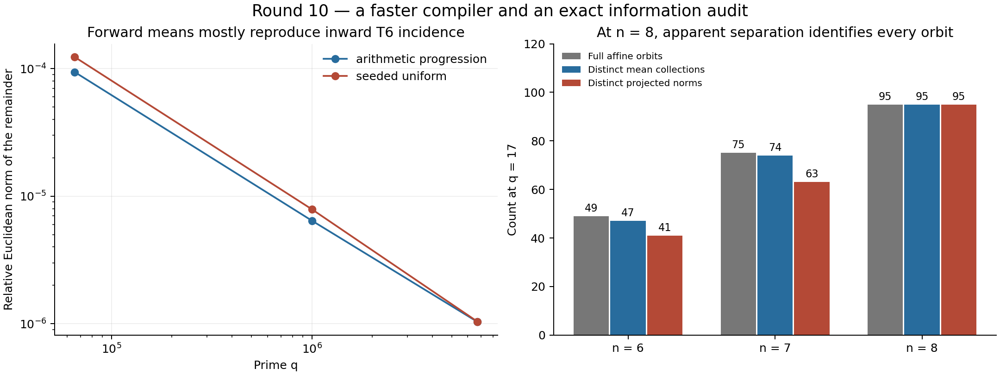

# Round10: all pair means, and an information audit

The new compiler computes exact conditional means for **every deletion pair at once**, through q=6,700,417,n=50. Its 1,225 pair means describe the entire distance-two shell of 27,498,133,131,022,225 final sets. A separate implementation verifies every mean through a different identity, with no sampled large entries.

The mathematical audit changed the direction. The projected means at six and seven selected points reduce completely to quartic incidence and the induced graph. At eight points over F17, even the projected norm identifies every full affine orbit. At larger chosen inputs, the projected means mostly reproduce inward sixth-degree targets. The compiler is useful computation, but these observations disqualify the proposed interpretation as newly discovered arithmetic information.



## Use the compiler

```sh
c++ -O3 -std=c++17 tooling_lab/round10/pair_means_backend.cpp -o tooling_lab/round10/pair_means_backend
python tooling_lab/round10/query.py 17 --selected 0 1 2 3 4 6 10
```

[query.py](query.py) exports `query(q, selected, degree=6)`. It returns every deleted pair, the exact sum over ordered distinct outside insertion pairs, its rational mean and a timing observation. It accepts prime q congruent to1 modulo4, q at most10million, n at most64, degree0 through6 and at least two outside points. The [small matrix reference](deletion_pair_means.py) validates the conference identities and supports order at most257.

A row pass constructs one scalar, one vector and one weighted Gram matrix, with explicit corrections where a deleted column has a zero. Cost is O(q(nD+n²)), with O(q+n²) storage. The final largest runs took 32.4 and 17.6 seconds on the shared machine; this is not a controlled speed comparison. [DERIVATION.md](DERIVATION.md) includes the complete formula and integer bounds.

## Independent decomposition and what it rules out

For A=C without the deleted pair and T_j(B) the degree-j row target, the mean numerator decomposes into:

- inward degree-D targets on C and its one- and two-point deletions;
- degree D−2 and D−4 versions of those targets;
- a boundary term determined by the induced matrix S[C,C].

The independent [inward-target backend](inward_targets.cpp) uses counts of signs, not the forward Boolean weights or weighted Gram construction. [decomposition.py](decomposition.py) reconstructs the mean from these different inputs. This verifies every one of the **3,650 pair means** across the eight frozen scale cases.

Removing all vertex-additive effects eliminates the full and singleton-deletion terms. At D=6, the projected T2 term is constant and vanishes. If n is6 or7, the inward T6 term also vanishes because only4 or5 points remain. Consequently the projected separation found in round9's twins is already explained by quartic incidence and the induced graph. This is an exact identity, not a statistical fit.

For larger inputs the inward T6 term survives. At q=6,700,417 its contribution differs from the complete projected mean by relative Euclidean norms of approximately1.036×10⁻⁶ and1.041×10⁻⁶ on the progression and seeded input. These inward targets are not independent explanatory features: their sum over deleted pairs recovers C(n−6,2)T6(C). No uniform bound is inferred from the small observed remainder.

The complete Paley17 orbit audit gives:

| Selected size | Full affine orbits | Distinct mean collections | Distinct projected norms |
|---|---:|---:|---:|
|6|49|47|41|
|7|75|74|63|
|8|95|95|95|

At n8, both summaries identify the full orbit. At n7, one mean collection still joins two distinct full orbits; at n6 there are two such collections. Exact witnesses are saved in [projection_toy.json](projection_toy.json). These finite separations cannot establish a general cheap closure.

## Verification

- 35 small and boundary cases compare all 14,855 pair means with the dense reference and independent inward decomposition; 2,229 inward targets also receive literal subset-product checks.
- All 3,650 scale means are independently recomputed, including all 1,225 entries in each largest input.
- Twenty-four affine controls reindex 525 pair entries, covering degrees0 through6. Eight invalid queries are rejected, and conservative integer bounds cover the accepted domain.
- All 438 prior square-affine representatives at sizes6,7,8 receive the exact decomposition and projection audit.
- A separate histogram calculation recovers the complete distance-two mean on all eight scale inputs and agrees with the new pair sums. The global mean uses no information beyond the old row histogram.

The original [183-comparison preflight](preflight_results.json) is retained as the initial snapshot and is labeled with its then-pending scale status. The completed checks are [boundary_verification.json](boundary_verification.json), [scale_verification.json](scale_verification.json), [controls_verification.json](controls_verification.json) and [shell_mean_verification.json](shell_mean_verification.json). Arithmetic implementations were run locally by the root agent; there is no human referee report or new Lean certification. [manifest.json](manifest.json) binds the completed round and preserves all31 round9 artifacts.

To reproduce, compile both C++ sources, run `deletion_pair_means.py`, `review.py`, `run_scale.py`, `review.py scale`, `projection_analysis.py`, `projection_analysis.py scale`, `controls.py`, `shell_mean_review.py`, `plot_results.py`, and `verify_round.py`. Use `/opt/miniconda3/bin/python3` on this machine.

## Next research step

The [prior-art audit](prior_art.md) records the existing mathematics and the local ratio-fiber work. We retain this compiler as a query and as a check against mistaking target-related information for an explanation. Historical originality is unestablished; neither prize was attempted.

[Round11](../round11/README.md) has already begun a coding prototype: exact worst-case coordinate-pinning probabilities for declared polynomial clusters. Its initial rank-two interface avoids enumerating all agreement sets. It must keep cluster discovery, general-dimensional extension and actual arithmetic verification separate from the pinning guarantee.
