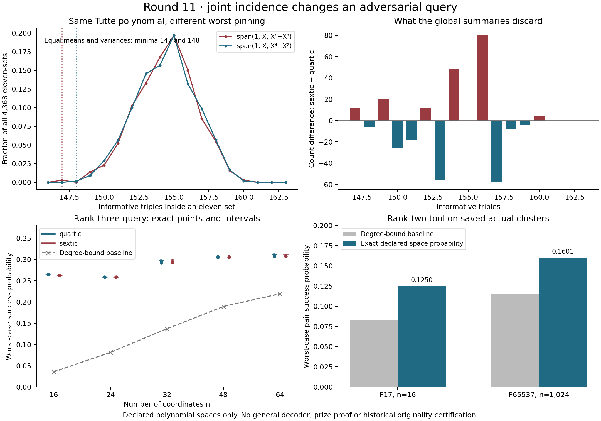

# Round 11: pinning probabilities and a precise loss of information

This round supplies two executable tools for declared polynomial spaces and a finite obstruction showing why their input representation matters. It attempts neither prize proof. The underlying matroid, coding and search machinery has prior art; historical originality of the precise examples and implementation remains unestablished. See the [derivation](DERIVATION.md) and [primary-source audit](prior_art.md).

The clearest finding is an actual pair of degree-<8 polynomial spaces over F17:

```
span(1, X, X⁶+X²)     and     span(1, X, X⁴+X²),
evaluated on 1,...,16.
```

They have identical Tutte polynomials, codeword weight distributions, generalized Hamming weights, dependency-degree lists, and line-size lists. Even the mean and variance of the informative-triple count over all eleven-coordinate sets agree. Yet the minimum count is 147 for the first space and 148 for the second. The [independent review](rank_three_review.json) checks all 131,072 subsets and all 9,826 codewords across the pair; the [moment review](collision_moments.json) also derives the first two moments from overlapping dependent triples. This proves a specific information loss on actual polynomial inputs. It is not a historical novelty proof.



## The two tools

[polynomial_cluster.py](polynomial_cluster.py) accepts a prime field, distinct domain, degree limit, two basis polynomials, optional affine origin and agreement threshold. It partitions evaluation columns into zeros and projective classes, then obtains the exact worst-case informative-pair count by filling the largest classes. Ordinary operation cost is O(n log n), with field arithmetic costs additional. The certificate includes an attaining agreement set and the exact probability when sampling uniformly among all C(n,2) coordinate pairs.

[rank_three_pinning.py](rank_three_pinning.py) accepts a declared simple rank-three polynomial space. It retains the actual coordinates on every nontrivial maximal line and optimizes their joint occupancies with integer branch-and-bound. It exports a full search tree. Unfinished branches give a certified interval rather than an asserted optimum. Its current public domain cap is 256; larger scaling is the next iteration. Full line incidence determines the rank-three matroid, so this is a query implementation, not a new compressed invariant.

The [rank-two verifier](independent_verifier.py) imports neither constructor nor polynomial adapter. It uses direct determinants and an independent integer dynamic program for optimality. The [rank-three verifier](rank_three_verifier.py) imports neither constructor nor search code. It reevaluates polynomials, checks every triple by Gaussian elimination, verifies line maximality and replays the entire search tree. These are separate code implementations run by the primary agent, not human refereeing or Lean proofs.

## What was actually tested

| Evidence | Coverage and result |
|---|---|
| Rank-two abstract preflight | All 3,000 length-five rank-two projective patterns over F3; 18,000 thresholds against 96,000 literal subsets. |
| Saved small candidate data | Every 804 rank-two plane among 816 triples of 18 saved nodes independently optimized. Worst minimum: 15 informative pairs in every eleven-set. |
| Saved large rank-two cluster | F65537, n=1,024, k=64, s=410: exact minimum 83,836 versus universal degree-bound baseline 60,378. All 523,776 coordinate pairs and all 83,845 witness pairs checked; 670,057 dynamic-program transitions establish optimality independently. |
| Rank-two controls | Eight polynomial basis/permutation controls; two abstract coordinate-scaling controls; 38 common-root extremizers; eight malformed inputs and seven corrupted certificates rejected. Arbitrary coordinate scaling is not asserted to preserve the RS degree limit. |
| Rank-three discovery | Complete eleven-set censuses for 246 specified spaces span(1,X,f), with f monomial or binomial of degrees 2 through 7 over F17. There are 1,074,528 set evaluations. This is not a census of all degree-<8 subspaces. |
| Rank-three boundary controls | 70 threshold cases, 2,760 literal subsets, six polynomial basis/permutation controls, plus six abstract GL3/permutation/scaling controls on the collision. Eight invalid inputs and seven corrupted search certificates rejected. |
| Saved actual rank-three clusters | All 3,060 node quadruples classified: 166 dependent, 55 simple rank-three, 2,839 nonsimple rank-three. All 55 supported cases solved exactly and checked against all 240,240 eleven-sets. Minimum over those cases: 120. The unsupported 2,839 are not silently discarded from a coverage claim. |
| Synthetic scaling | Ten specified polynomial inputs at n=16,24,32,48,64. Four exact answers; six certified intervals. Every evaluation triple and every search-tree node independently checked. |

The two synthetic families are span(1,X,X⁴+X²) and span(1,X,X⁶+X²), always with ambient degree bound k=8. The [scale results](rank_three_scale.json) are:

| p, n, s | Quartic minimum / certified interval | Sextic minimum / certified interval | Universal baseline |
|---|---:|---:|---:|
| 17, 16, 11 | 148 | 147 | 20 |
| 29, 24, 16 | 523 | 523 | 165 |
| 37, 32, 22 | [1452,1479] | [1455,1483] | 680 |
| 67, 48, 33 | [5274,5330] | [5280,5335] | 3276 |
| 67, 64, 44 | [12825,12987] | [12821,12965] | 9139 |

Divide by C(n,3) for the probability of selecting an informative triple wholly inside any agreement set of at least s coordinates. The upper endpoint comes from a feasible adverse set; the lower endpoint is a guarantee for every such set. The table does not claim exactness for the intervals. These low-dimensional supplied spaces can be much better than the universal degree-bound extremizer without implying a uniform decoding result.

## Application boundary and next experiment

The [actual-input audit](rank_three_actual.json) also constructs a rank-three space from four verified near-codeword points in the saved large two-track example. It has n=1,024 distinct nonzero projective columns and no parallel pairs. Each source point agrees at 512 coordinates with its corresponding received-word scalar; the current rank-three optimizer has not yet been applied at full length. Some source nodes are attached to different scalars. Neither a single-scalar cluster cover nor the clusters needed for a general decoder are asserted.

The next tool must support zero/parallel columns so the small audit stops excluding most actual spaces. For the full-length simple example, a quadratic pair-space certificate can replace cubic triple enumeration. These are concrete next representations to implement, followed by tests of whether stronger incidence bounds close the current intervals without an exponentially larger search. The general cluster-discovery, coverage, uniform asymptotic and prize-specific obligations remain open.

The Paley connection is a research lesson, not a reduction: previous rounds exposed failures of global moment summaries; this round finds the same type of aggregation loss for actual codeword dependencies. No Paley spectral estimate follows from the coding certificates.

## Reproduction

Use `/opt/miniconda3/bin/python3`, or Python with NumPy and matplotlib for the census/figure scripts. The two query compilers and their standalone verifiers otherwise use the standard library.

```sh
python3 tooling_lab/round11/polynomial_cluster.py tooling_lab/round11/hard_f17.input.json
python3 tooling_lab/round11/independent_verifier.py tooling_lab/round11/large_f65537.certificate.json
python3 tooling_lab/round11/rank_three_verifier.py tooling_lab/round11/rank3_p67_n64_quartic.certificate.json
python3 tooling_lab/round11/verify_round.py
```

The integration verifier checks all saved certificate bindings and the preceding snapshot, reruns standalone certificate checks, and records the [manifest](manifest.json). Discovery and regeneration scripts are retained alongside their results. Earlier snapshots are preserved. None of these checks certifies originality or a prize theorem.
