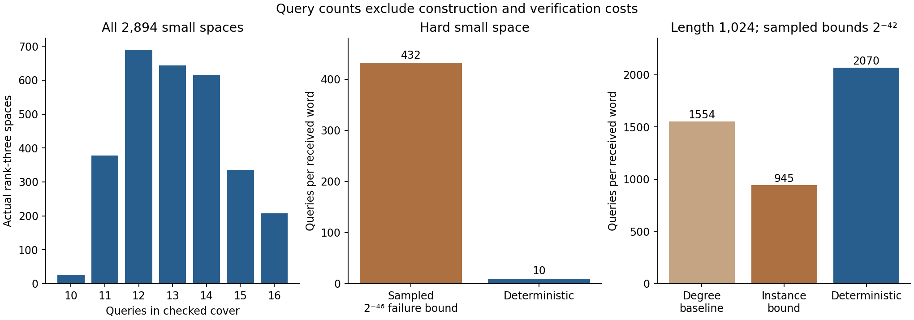

# Round 13: inexpensive certificates for complete coordinate queries

The new interface replaces an expensive minimum-density calculation with a short, deterministic query cover. It works on supplied affine rank-three polynomial spaces and does not discover those spaces. The underlying covering and interpolation arguments are known; the [prior-art audit](prior_art.md) distinguishes them from this concrete implementation.

The [compiler](query_cover.py) partitions coordinates into small blocks and lists their informative triples. Within each block it computes the largest subset avoiding every listed triple. If those local maxima sum to less than the agreement threshold s, every s-set contains an informative query. The [separate verifier](cover_verifier.py) checks query ranks by Gaussian elimination and enumerates all local subsets. Independence numbers add across disjoint blocks, giving an exact coverage threshold for this particular query family. See the [derivation](DERIVATION.md).

| Input | Checked query family | Largest set avoiding every query | Guarantee |
|---|---:|---:|---|
| Saved hard F17, n16, degree<8 space | 10 triples | 10 | Every agreement set of size at least 11 is hit |
| Saved F65537, n1024, degree<64 space | 2,070 triples | 409 | Every agreement set of size at least 410 is hit |

The large partition has 201 blocks of size five, three of size six, and a singleton. Every triple within a non-singleton block is independent. Avoiding every query allows at most two coordinates per such block, plus the singleton: 2*204+1=409. This checks 2,070 query ranks and 6,626 local subsets, rather than all 523,776 pair spans used by round 12. It does not claim that 2,070 is the globally smallest possible query family.

The [deterministic pruner](deterministic_pruning.py) solves the listed coordinate equations, deduplicates candidates and checks their complete agreement. Once its certificate is checked, it returns every nearby member of the supplied space for **every received word**, without a sampling assumption. The bounded search that finds a partition can fail; that does not invalidate a successfully checked certificate or prove that a cover is impossible.

The [actual runs](actual_results.json) recover the complete lists for all 17 small received scalars and the two large test scalars. The [independent execution review](pruning_review.json) replays all 4,310 queries by Gaussian elimination and recomputes 3,240 distinct candidates. It separately checks the exhaustive 4,913-member small oracle and the large two-piece root-bound oracle from round 12. These special large words each have exactly two nearby polynomials even in the entire degree<64 ambient code; the general interface still only promises coverage of its declared space.

The [family audit](family_results.json) finds covers for **all 2,894 actual rank-three spaces**, using 10–16 queries each. It independently checks 38,006 query ranks, 185,216 local subsets and **12,640,992 complete eleven-coordinate subsets**. Nodes can belong to different received-word scalars, so this is a census of supplied spaces, not a scalar-specific cluster-cover theorem.

The [controls](controls.json) enumerate all 65,536 subsets for the hard small cover and all **3,125 received words** of the F5, n5, degree<3 code, with complete 125-member oracles and 31,250 Gaussian query replays. They reject 15 damaged certificates and six altered output records, check coordinate and basis transformations, handle an explicit common-root space, and distinguish search exhaustion from proof of nonexistence. The standalone verifier refuses Python's assertion-disabling `-O` mode.



The recorded large construction took about 0.012 seconds and checked preparation about 0.138 seconds; the two actual prunes took about 2.85 and 1.40 seconds. Round 12's recorded certificate construction and verification cost about 34 and 105 seconds, while its two sampling runs took about half a second after preparation. These are observations on a shared machine, not a controlled benchmark or a universal speedup claim. The new tool trades more large-input queries for cheap verification and a deterministic guarantee. Neither method's per-word query count includes preprocessing or all candidate-verification work.

From this directory, use `/opt/miniconda3/bin/python3`:

```sh
python3 cover_verifier.py full_length.certificate.json
python3 deterministic_pruning.py full_length.certificate.json received.json
python3 verify_round.py
```

`received.json` is a canonical field-valued array of the certified length. The public search command accepts a degree-bounded polynomial input and a JSON array of block sizes; it returns either a certificate or an explicit bounded-search failure. The [integration manifest](manifest.json) binds the completed reviews and preserves round 12. No proof-project files were modified.

The next limitation is dimension. The same coverage logic makes sense for dimension d, but local query counts and verification costs grow quickly. The next prototype should measure that growth on actual small spaces and declared enlargements of the large input, compare against known deterministic pruning, and retain explicit failures rather than treating this rank-three success as a general solution.
