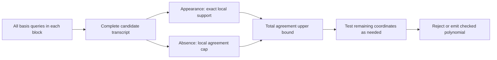

# Round 14: agreement bounds from complete query transcripts

This round completes a public coordinate-cover and pruning interface through dimension eight, with full-length arithmetic tests through dimension five. Its main new lab tool retains the information in **where a candidate appears and where it does not** after interpolation. The mathematical identities are elementary; historical novelty remains unestablished. [Prior-art audit](prior_art.md).

The [arc compiler](arc_certificate.py) checks a degree-bounded affine polynomial space, reserves zero columns, selects or validates a partition, and queries every d-subset within each queried block. The [standalone verifier](arc_verifier.py) independently checks the field, inputs, partition and query ranks using integer determinants. A cover guarantees complete recovery inside the supplied space for every received word. Discovery of a suitable space is a separate obligation.

The [pruner](arc_pruning.py) then retains the complete query transcript. If a candidate agrees on h coordinates of an arc block, it appears exactly C(h,d) times. If it appears, the union of those queries is its entire local agreement support. If absent, it has at most d-1 agreements there. Those exact facts give an upper bound on total agreement; explicit coordinate tests refine it until the candidate is rejected or its agreement is known. The [derivation](DERIVATION.md) proves the contract and its limits.



The [actual runs](actual_arc_results.json) cover all 17 small received scalars and 12 large received-word/space/threshold combinations. The large supplied space is extended by X and then X² at dimensions four and five; these are declared superspaces. Agreements 192 and 128 are deliberately below the ambient degree<64, n1024 Johnson threshold, since their squares are less than 63*1024=64,512. The older agreement410 test is above that threshold. These experiments do not establish a general below-Johnson decoder.

Representative scalar-zero runs:

| Supplied dimension | Agreement threshold | Queries | Generated candidates | Explicit coordinate evaluations, including output words | Full scan of those candidates |
|---|---:|---:|---:|---:|---:|
| 3 | 410 | 2,070 | 1,556 | 4,627 | 1,593,344 |
| 4 | 410 | 7,245 | 6,492 | 9,411 | 6,647,808 |
| 5 | 410 | 26,334 | 24,791 | 27,589 | 25,385,984 |
| 3 | 192 | 14,685 | 11,065 | 13,186 | 11,330,560 |
| 4 | 192 | 122,500 | 105,802 | 107,887 | 108,341,248 |
| 3 | 128 | 37,080 | 27,544 | 29,607 | 28,205,056 |

These are coordinate-evaluation counts, not runtime speedup factors. They exclude certificate verification and solving the listed query systems. On the four-dimensional agreement192 scalar-zero input, 105,799 rejected candidates needed one coordinate test and one needed two. This favorable structure is measured, not assumed in the correctness proof.

The [separate complete review](arc_review.json) reconstructs **419,998 queries** using integer Cramer determinants, evaluates **354,645 complete candidate words**, and checks **362,993,184 coordinate values** with overflow-bounded integer arrays. It validates every support inference, agreement bound, test trace and output. Small lists also receive exhaustive 4,913-member oracles. The original large words each have two polynomial pieces agreeing at 512 positions; any third degree<64 polynomial agrees at most 126 times, proving complete ambient lists on those special words even at threshold128.

The [stress tests](stress_results.json) plant words exactly at or one below agreement128. A true candidate can appear in only one query, so a frequency cutoff is invalid. Another true candidate disagrees at the unqueried singleton, so an unconditional guard-coordinate filter is invalid. A false candidate with 127 agreements requires **1,008 coordinate tests** before rejection. All three stress lists are independently checked inside the supplied space; the two-piece ambient oracle does not apply to them. The filter retains a worst-case cost proportional to the word length for an individual candidate.

The [public-interface controls](arc_controls.json) exhaust **12,500 received words** across dimensions two through five over F5, replay 81,250 queries, and use complete ambient codeword oracles. They reject 14 corrupted certificates, eight altered transcripts/filters and three altered coordinate-test traces. Separate controls distinguish zero-column impossibility, bounded search failure and a query-budget limit. [Higher-dimensional controls](higher_dimension_controls.json) exercise dimensions six through eight, including common roots, against complete unique-list root-bound oracles. Python's assertion-disabling `-O` mode is refused by the verifier.

The [shared-order filter](arc_filter_fast.py) avoids rebuilding the entire testing order for each candidate. Its [comparison](filter_comparison.json) matches every decision and output on all 29 actual runs, the small boundary case and all three stress words. Its timings are observations from separate runs on a shared machine, not a controlled end-to-end benchmark.

Use `/opt/miniconda3/bin/python3` from this directory:

```sh
python3 arc_verifier.py d4_s192.certificate.json
python3 arc_filter_fast.py d4_s192.certificate.json received.json
python3 arc_certificate.py polynomial_input.json
python3 verify_round.py
```

The input includes p, n, k, s, dimension, distinct domain points, origin and basis polynomials. The interface accepts dimensions 2–8, n<=4096, block size<=64 and at most 250,000 queries. Search can return an explicit rank-deficient s-set, an exceeded query budget, or bounded failure. Only a checked certificate gives a coverage guarantee. The reference pruner emits full transcripts and decisions to make its computation reviewable.

The earlier [dimension preflight](dimension_results.json) and [profile controls](profile_controls.json) remain useful: the complete-block cost at n1024,s410 grows to 2,090,660 queries at dimension eight. Full-length arithmetic at dimensions six through eight is still untested. The complete [manifest](manifest.json) binds this checkpoint and preserves every round-13 artifact; the earlier checkpoint.json is a historical preflight snapshot.

The next tool must handle projective-class capacities during block construction. A class of size c can supply at most one point per queried arc block. A profile with t queried blocks and u unqueried coordinates therefore needs c<=t+u, and multiple classes impose a stronger aggregate constraint. This prevents searching profiles that arithmetic makes impossible. It does not resolve cluster discovery, all higher-rank incidence constraints, the general prize obligations or the Paley spectral problem.
