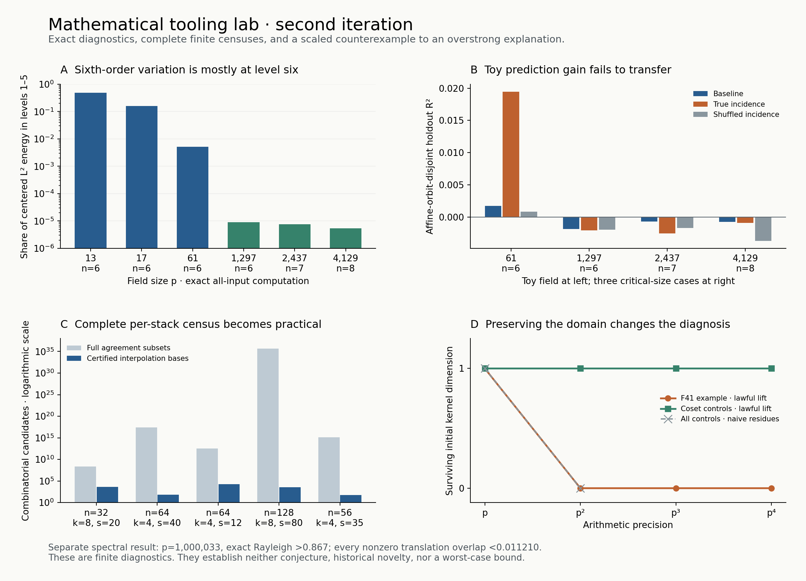

# Second iteration: tools that survive their first failure

This round produced four working capabilities, including an exact character-moment diagnostic that scales beyond field enumeration. It also rejected two tempting interpretations: a small-field incidence separator did not become a useful critical-size linear predictor, and even a million-prime spectral outlier need not have a large ordinary translation overlap.

The work investigates missing mathematical tools. It does not attempt either prize proof. Historical novelty remains unestablished: the ingredients have prior art, and a bounded search cannot prove nobody has used the exact combinations. The concrete contributions here are executable combinations, correctness arguments, independent checks, and new finite evidence from this laboratory.



## What changed

| Capability | New information or computational reach | Scope |
|---|---|---|
| Exact exchange-spectrum diagnostic | Decomposes the missing sixth character statistic into Johnson harmonic levels. A grouped generating-function backend computes exact all-input energies at p=6,700,417 without enumerating the field or input sets. | Exact finite second moments; no worst-case estimate. |
| Complete compressed agreement census | Replaces all agreement subsets by a certified covering family of interpolation bases, preserving every scalar, codeword and maximal support. | Complete output for each supplied stack; exponential cost can remain at fixed rate. |
| Domain-preserving arithmetic lift diagnostic | Distinguishes a special-characteristic dependency from persistent coset identities, where earlier root-edit tests could not. | Exact kernel survival through p⁴ on five examples. |
| FFT discovery with exact spectral replay | Computes both spectral signs at p=1,000,033 using450MB, then verifies integer witnesses and every translation by exact modular convolution. | Finite lower witnesses; no global spectral upper certificate. |

## Character moments: locate the missing interaction before proposing a bound

Round one found two p=61 sets with the same low moments, boundary data, energy and unordered quartic deck but different sixth moments. Attaching the quartics to their actual column subsets resolved the remaining toy ambiguity. That suggested a cheap incidence contraction worth testing, not a scalable estimate.

The new [critical-size audit](observables/README.md) tested raw and centered quartic-incidence triangles at `(p,n)=(1297,6),(2437,7),(4129,8)`. It used fixed seeds, shuffled-incidence controls, selected arithmetic stress sets, and a revised split that excludes affine-equivalent training/evaluation inputs. Adding the candidate contractions did not improve the tested linear predictor on any of the three random holdouts. Transferring the toy coefficients made prediction substantially worse. These observations weaken this representation, without proving that nonlinear incidence information is useless.

The next prototype makes a more precise inquiry. Regard n-subsets as vertices of the Johnson graph, with an edge replacing one selected field element. The known harmonic projectors split the sixth character U-statistic into degrees0 through6. An arithmetic generating function computes all needed replacement averages exactly from character-row histograms; no neighborhood of sets is enumerated.

An independent implementation then computes the exact **all-input L2 spectrum** from paired character rows, using a separate Eberlein inversion. Finally, grouping the paired rows by their six possible types removes even the field-element loop. At fixed degree, this coefficient calculation depends on p and n through bounded-degree integer expressions.

At p=6,700,417,n=50, the exact share of centered L2 energy in degrees1 through5 is approximately `3.4581e-10`. The fractions are saved, not inferred from a fitted trend. Both original p=61 collision pairs also have exactly the same components in degrees0 through5, with a difference of32 entirely in degree6.

This localizes the missing information. Under the full uniform measure, a degree-six harmonic component is orthogonal to every membership polynomial of degree at most five. It does **not** follow that a nonlinear function of a handful of measurements has low membership degree. Nor does small average lower-degree energy bound a rare set. The diagnostic deliberately uses the target and must not be presented as a target-free prediction feature.

The [novelty and information-loss audit](novelty/exchange_novelty.md) finds a further limit: the global L2 calculation depends only on classical paired-row intersection data. It cannot distinguish two character-like arrays sharing those data, even if their higher arithmetic behavior differs. The next counterfactual prototype is therefore looking for explicit paired-row-matched examples with different higher-order behavior. This tests the new tool's own information loss rather than treating exact computation as sufficient information.

See [exact independent derivation](observables/review_exchange.md), [grouped implementation](observables/exchange_grouped.md), and [arithmetic stress inputs](observables/stress_exchange_results.json).

## Code incidence: compress the enumeration without losing completeness

The [agreement-support tool](proximity/README.md) chooses disjoint coordinate blocks whose outside capacity plus `k-1` points per block is below the agreement threshold s. Every qualifying support therefore contains a k-point interpolation base in one block. Each base determines an entire affine codeword track. Coordinate residuals then identify all qualifying scalars on that track without scanning the field.

The output preserves multiple codewords at one scalar, exact maximal supports, duplicate-track multiplicities, and symbolic whole-field tracks. Its complete node output matches all16 previous prime-field stacks and all7 extension controls. Independent review compared4,962 complete outputs against direct polynomial/scalar enumeration over827 tiny pencils.

For one n=128,k=8,s=80 stack,3,465 bases replace approximately4.34e35 agreement subsets. A harder n=64,k=4,s=12 case lies below the usual Johnson agreement threshold and completes with16,815 bases. Each selected large stack has exactly two qualifying scalar/codeword pairs, with complete output repeated under a different cover.

Fewer bases did not initially mean faster execution. The first interpolation implementation was slower than the tiny parity oracle. Prefix/suffix products removed that bottleneck, and both runs are preserved. At n=1024,k=64,s=410 the cover still requires about3.57e47 bases. Thus this is a practical complete oracle on larger simplified cases, not a production-scale decoder or a bound over every possible stack.

## Arithmetic dependencies: require a lawful lift

Round one's on-domain root edits destroyed both the F41 dependency and structural coset examples. The [arithmetic lift diagnostic](novelty/README.md) instead lifts each root uniquely while preserving `x^n=1 mod p^e`, then computes which initial syzygies lift through successive precisions.

The F41 kernel survives with dimensions `[1,0,0,0]`; four coset controls give `[1,1,1,1]`. A short F41 certificate pairs a left annihilator with the first carry vector to give32 modulo41, certifying failure to lift at p². The longer matrix certificates are independently replayed.

Simply treating finite-field residues as fixed integers incorrectly kills every coset control at p², because those representatives usually leave the roots-of-unity domain. The prototype also pinpoints this convention mismatch in an older local note. Hensel lifting and Smith theory were already known and partly used in this workspace; the useful addition is a lawful matrix-kernel diagnostic with explicit convention controls. A broader taxonomy of persistent and transient dependencies remains to be built.

## Spectral outliers: scale a falsifiable explanation

The [spectral tool](spectral/README.md) uses the character Fourier multiplier for matrix-vector products, separate positive/negative Ritz spaces, and the already known S3 symmetry to recover partners missed by a single Lanczos start. It completed both signs at p=1,000,033 in667.5seconds with a450MB process peak, avoiding a dense matrix of approximately500GB.

Numerical discovery is separated from exact acceptance. Integer coefficients are serialized; an NTT reconstructs their character convolution under a checked uniqueness bound. Sign-aware integer inequalities certify strict rational Rayleigh bounds. A second independent backend uses Python integer packing for all smaller witnesses through p=65537. The million-prime case has additional independently checked convolution rows and translation shifts.

One million-prime witness has

```
Rayleigh(H) > 0.867 > sqrt(3)/2,
max_(t nonzero) |<v,tau_t v>| / ||v||²
  = 2,189,980 / 195,367,076 < 0.011210.
```

Every translation was checked by exact NTT. This rejects the overstrong claim that **every** vector exceeding the limiting edge must have a large ordinary translation overlap. It does not reject an existence claim about some other witness, an asymptotic statement with vanishing finite-size error, or the Paley conjecture.

The next phase-sensitive prototype is being developed separately in `../round3/phase_transport/`. It tests whether modulation retains information that ordinary translation discards, with chirp and matched-shuffle controls. Weyl ambiguity functions and their uncertainty identities are established machinery; the experiment must demonstrate a useful additional discriminator before deserving a stronger claim.

## What a further useful tool must accomplish

The next target is a representation that separates **arithmetic exceptional behavior** from what is already forced by average identities or normalization. There are three concrete directions:

1. Condition the exact high-order diagnostic on admissible arithmetic families, while keeping exceptional-set information and the conditioning cost explicit.
2. Certify whole batches of interpolation tracks or support families, retaining their overlaps, to escape the remaining exponential basis count.
3. Test richer phase-sensitive spectral transport against invariance and matched controls, rejecting statistics whose energy is automatically fixed by an uncertainty identity.

None is assumed novel merely because it is phrased differently. Each needs a mechanism, a comparison to known work, an exact or clearly numerical contract, a simplified test, and a failure criterion. A successful prototype should either expose a previously hidden distinction or compute a relevant object that the previous tools could not reach.

## Reproduce and verify

Use Python with NumPy/SciPy/Matplotlib and clang++. The local root runtime is `/opt/miniconda3/bin/python3`; discovery runtime details are saved in each lane. No external solver, API or message sending is needed.

From the Paley directory:

```sh
python3 tooling_lab/round2/run_round.py verify
python3 tooling_lab/round2/plot_results.py
```

`verify` rebuilds the exact C++ checker, replays all saved witnesses including the million-prime cases, runs independent tiny oracles, and repeats the declared observable audits. It regenerates verification JSON and checks saved input data. `full` additionally regenerates the bounded default experiments through p=65537; `million` separately repeats the more expensive million-prime eigensolver before verification. Numerical eigenspaces may change with the runtime, so the hashed saved integer certificates are the portable evidence.

The [verification log](verification.log), [manifest](manifest.json), standalone [figure](overview.png), and [PDF](overview.pdf) accompany the code. Mathematical checks are independent agent/code reviews, not human refereeing or new Lean certification. Original proof records and the proximity checkout remain read-only inputs.
