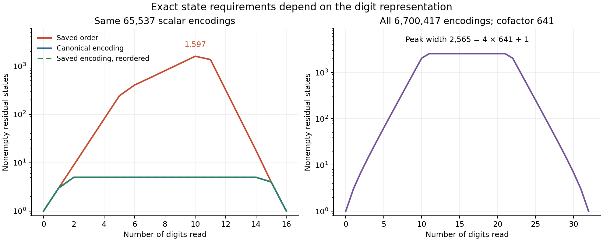

# Round20: complete digit families and certified state requirements

**Completed and independently replayed, September6,2026.** This round turns the generator-two digit language into an exact completion tool, measures the effect of coordinate order, and gives explicit lower-bound witnesses for the general two-billion-point input. It also identifies the next missing capability: exact equivalence of partial completion sets without a complete scalar codebook. Neither prize is being proved; historical novelty is unestablished.



The strongest concrete representation result is at p65,537. Its saved encoding requires a peak of1,597 nonempty residual states in the natural coordinate order. Reordering the same digits using the previously certified orientation permutation reduces the peak to5 and the full graph from6,650 nodes to74. All65,537 scalar encodings remain present. The canonical p257 and p65,537 languages have peak5; the saved p257 order peaks at60 and also returns to5 after reordering. These are exact finite minimal widths for the specified layered readers, excluding an implicit rejecting state.

At p6,700,417,N32,cofactor641, the symbolic constructor represents every scalar word, including zero, in36,381 nodes and67,668 edges. It does not enumerate p scalars or the ternary ambient cube. Its exact peak width is2,565=4*641+1. It can count completions after fixing arbitrary digit coordinates and list a requested number of them. The query D0=0,D7=1,D19=-1 has209,394 completions; [the saved example](query_example.json) lists five and marks that list truncated.

The k=1 construction also has an exact general width profile `1,3,5,...,5,4,1`, proved in [the derivation](DERIVATION.md). Thus its diagram has5N-6 nodes. The N128 control represents2^128+1 words in634 nodes. This control uses a composite modulus; it is not evidence about an infinite prime family or a norm estimate.

The [cross-splice certificates](splice_summary.json) use the general projection/re-encoding codec. Every prefix/suffix acceptance is exact. A greedy own-suffix clique is improved by using all supplied suffix columns, then by adding counterexamples when a complete residual oracle exists:

| Input and cut | Own-suffix lower bound | All supplied suffixes | After adaptive suffixes | Exact full width |
|---|---:|---:|---:|---:|
|p65,537 canonical, cut8|5|5|5|5|
|p65,537 saved, cut8|144|195|205|801|
|p6,700,417 canonical, cut16|245|245|245|2,565|
|p2,013,265,921 natural, cut4|203|203|Unavailable|Unknown|
|p2,013,265,921 natural, cut8|255|255|Unavailable|Unknown|
|p2,013,265,921 natural, cut32|256|256|Unavailable|Unknown|
|p2,013,265,921 reversed, cut32|256|256|Unavailable|Unknown|
|p2,013,265,921 even-then-odd, cut32|256|256|Unavailable|Unknown|

The saved p65,537 prefix sample occupies205 actual residual classes. Nine new suffixes separate all of them; they do not discover the596 classes outside this prefix sample. The N64 bounds stop at the256-word sample ceiling. They do not prove growth, optimality of any order, or a lower bound against arbitrary algorithms. Equal sampled response rows are never treated as proof of equal completion sets.

The [prior-art audit](prior_art.md) explicitly credits fixed-order decision diagrams, Myhill–Nerode distinguishability, signed-digit transducers, and Angluin's membership/equivalence distinction. Those ingredients are not inventions of this project. The project additions are the arithmetic interfaces, finite certificates, complete datasets and experimentally justified change in the next tooling obligation.

## Use the completion tool

Run from the repository root with the installed scientific Python:

```bash
/opt/miniconda3/bin/python3 tooling_lab/round20/complete_query.py --diagram tooling_lab/round20/symbolic_N32_k641.json --fixed 0=0,7=1,19=-1 --limit 5
```

Coordinates are zero-based in the **original digit order**, including when the stored diagram uses a reordered traversal. The result includes the complete count, scalar residues, original-coordinate digit words, the listing order and a truncation flag. `--limit 0` returns a count only. Every listed word still costs output time; compact counting is not constant-time enumeration.

The reusable core is [decision_diagram.py](decision_diagram.py). [build_completions.py](build_completions.py) builds eight complete scalar-census diagrams and five symbolic families. The general membership interface remains [round19's codec](../round19/projection_codec.py). The counterexample-guided finite interface is [residual_refinement.py](residual_refinement.py).

## Evidence and limits

- [Completion review](completion_review.json): independent dense-matrix equality for197,520 scalar words across eight complete cases, including two general N4 relation controls. A separate binary-endpoint recurrence checks37,471 reachable diagram/language pairs across five symbolic cases. All234 recorded completion queries and1,804 listed words pass.
- [Splice review](splice_review.json):2,048 scalar encodings and all524,288 cross-splices checked using direct powers and dense NumPy integer matrices, with explicit int64 overflow bounds. Every reported own-suffix pair witness passes.
- [Refinement review](refinement_review.json): every reported distinguishing column checked by independent column partitioning; all2,304 words created by nine new adaptive suffixes replayed with exact dense arithmetic. The stopping criterion is verified against the complete diagrams only where they exist.
- [Query API review](query_review.json):16 additional count/list queries, original-coordinate mapping, composite-modulus outputs, and four invalid-query controls. The producer/reviewer suites reject12 corrupted graph, splice and refinement artifacts in addition to those invalid queries.
- [Manifest](manifest.json): source/input hashes and frozen-round preservation. Reviews are separate root-run implementations, not human review or Lean certification. Both proof projects remain read-only.

The next iteration should attack arithmetic residual equivalence or complete prefix fibres. Membership alone does not provide a complete learner or a norm aggregate. The N64 relation's huge cofactor remains a warning against a naive residue-state construction, and none of the finite width results supplies the uniform estimate required by the full Paley problem. The proximity work retains round16's complete supplied-affine-space scope; this round changes no proximity decoder.
