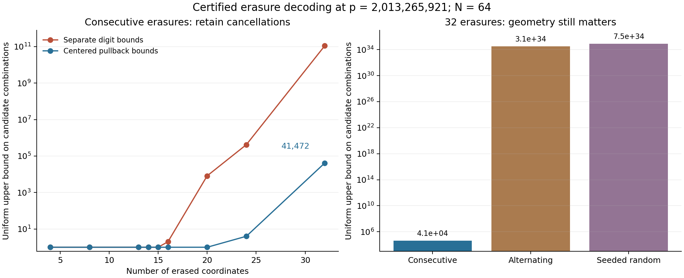

# Round21: exact erasure decoding through a scalar quotient

**Implemented and independently checked, September6,2026.** The new tool completes partially specified digit words on the general p=2,013,265,921,N64 input. It turns the large cofactor into a congruence check, removes lattice directions that cannot change the scalar, and retains cancellations in the original centered coordinates. Neither prize is being proved; historical novelty remains unestablished.



For the saved relation, the exact certificate proves **unique completion after any20 consecutive cyclic erasures**, using the remaining44 digits. It also gives a complete decoder for any32 consecutive cyclic erasures, with at most41,472 candidate combinations per query. These are guarantees for every remaining-digit assignment for these specific certificates, not success rates inferred from samples. The32-erasure statement is a list-completion guarantee, with no universal uniqueness claim.

The first prototype used only independent bounds on the compressed digits. The revised version bounds the same linear forms using the original centered coefficients, retaining cancellation:

| Consecutive erasures | Initial uniform candidate cap | Revised cap |
|---:|---:|---:|
|15|1|1|
|16|2|1|
|20|8,192|1|
|24|419,904|4|
|32|110,612,791,296|41,472|

Every candidate is re-encoded and checked against all known digits. The large cofactor9985208709332560769028097 is never enumerated as a state table. Exact basis preparation and large-integer arithmetic still have costs; no wall-clock speedup or uniform asymptotic claim is made.

The guarantee also changes how we certify state complexity. Different nonempty20-digit prefixes have disjoint residual languages. A separate complete census of scalars0 through99,999 finds100,000 distinct prefixes, proving a **100,000-state lower bound** at that cut for the specified deterministic layered reader. One erasure certificate implies all4,999,950,000 pairwise distinctions; no cross-splice matrix is constructed. This does not lower-bound arbitrary algorithms or every coordinate order.

The held-out geometry controls prevent overgeneralization. Sixteen new scalar anchors, each with a bounded edit, all completed under consecutive32 erasures. Alternating and seeded random32-coordinate erasure sets still exceeded the50,000-candidate budget. Their results explicitly remain incomplete, with no false zero-completion count. The failure is the next target for tool development.

## Use the decoder

The [input example](erasure_input.json) is a64-entry JSON array containing integers at known positions and `null` at20 cyclic erasures starting at57. Run from the repository root:

```bash
/opt/miniconda3/bin/python3 tooling_lab/round21/erasure_query.py --certificate tooling_lab/round21/pullback_erase20.json --input tooling_lab/round21/erasure_input.json --cyclic-start 57
```

The command verifies the cached rational certificate before decoding. The [output](erasure_output.json) recovers scalar1234567 and its full digit word from one scalar candidate. Original coordinate order is preserved across the cyclic sign changes.

For an initial32-coordinate erasure block, use `pullback_erase32.json`, mark positions0–31 as `null`, and omit `--cyclic-start`. The default candidate budget50000 covers its certified41472 cap. Other patterns require their own certificate; `budget_exceeded` means the search is incomplete. The API never presents that status as an empty completion list.

The reusable implementation is [lattice_erasure.py](lattice_erasure.py), with the stronger certificate transformation in [pullback_erasure.py](pullback_erasure.py). The [translation compiler](translation.py) also turns a proposed shared residual into an exact translated centering box, including degenerate-calibration cases. The full arguments are in [DERIVATION.md](DERIVATION.md).

## Verification

- [Translation review](translation_review.json):364,029 residual comparisons across complete p257 and degenerate p17 codebooks;27,441 distinct difference certificates and218,071 common-suffix incidents. It independently uses rational matrix inverses and direct suffix sets.
- [Initial erasure review](erasure_review.json):30 exact basis certificates,2,621 query replays,234,893 scalar candidates,1,825 full small-codebook oracle checks,512 cyclic15-erasure controls and six initial work-limit controls. Multiple-completion and non-unit syndrome cases are included.
- [Revised and held-out review](pullback_review.json):242 rational dual-functional identities,892 query replays,57,010 scalar candidates,512 cyclic20-erasure controls and64 cyclic32-erasure controls. All reported incomplete geometry cases are replayed as incomplete.
- [State-bound review](prefix_review.json):100,000 direct-power/dense-matrix encodings and exact prefix distinctness, coupled to the universal erasure-uniqueness certificate.
- [Command-line review](query_review.json):successful cyclic and half-word recovery, all17 completions of an entirely erased small code, explicit work-limit status, and rejected malformed inputs and a tampered certificate.

The suites also reject corrupted bases, inverses, scalar steps, radii, translation boxes and pullback forms. The [manifest](manifest.json) binds artifacts and preserves completed rounds. Reviews are separate root-run implementations, not independent human review or Lean certification. The original proof projects remain read-only.

The [prior-art audit](prior_art.md) credits established carry, lattice-decoding and duality methods. The project advances are the exact arithmetic interfaces, certificates, finite results and the correction from digit-only to centered-coordinate bounds. We have not established that nobody previously invented or tried this combination.

The next gap is general erasure geometry and arithmetic residual equivalence, followed by useful norm or spectral aggregates. These completion certificates do not control the full Paley spectral edge or solve the proximity prize; the separate proximity decoder retains its supplied-affine-space scope.
