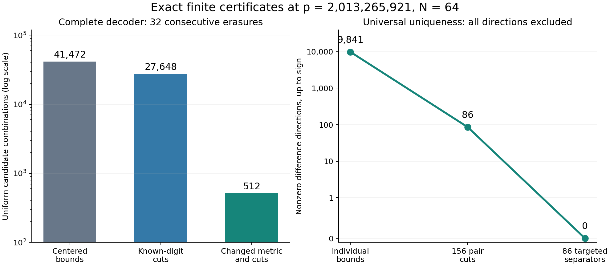

# Round22: exact conditioning and coupled erasure certificates

**New finite result:** for the saved relation at p=2013265921 and N=64, every assignment to the remaining32 digits has at most one completion after any32 consecutive cyclic erasures. Round21 certified this only for20 consecutive erasures. Existence is not guaranteed. Neither prize is proved, and historical novelty is unestablished.

The complete decoder now uses at most512 candidate combinations for these32-erasure queries, down from41472. On the same32 held-out queries, the maximum observed box falls from9216 to64. Their complete lists remain16 singletons and16 empty lists. The independent-coordinate certificate alone does not prove uniqueness; the coupled difference certificate supplies the additional guarantee.



## What changed

1. [Known-digit cuts](conditioned_erasure.py) subtract rational combinations of the exact known equations from each dual functional. The resulting interval has a shifted center as well as a smaller radius. Floating LP proposes coefficients; exact rational reconstruction and independent matrix identities establish validity. Feasible rational dual vectors additionally certify optimality where available.
2. [A changed lattice metric](metric_erasure.py) reduces the inverse-adjugate images of erased digits. An exact unimodular transform preserves the integer lattice. Every bound and scalar projection is rebuilt for the resulting coordinates.
3. [Coupled difference cuts](coupled_experiments.py) test which integer coordinate differences can occur together. For the consecutive case,19682 nonzero visible differences reduce to9841 representatives up to sign. The156 pair cuts leave86;86 strict rational separators exclude all remaining representatives. The [independent review](coupled_review.json) exhausts this entire finite set. Its largest targeted separating bound is2013265920/3686879371, about0.54606, strictly below1.

The practical insight is a measured distinction: individual bounds can be optimal and their Cartesian product can still contain thousands of impossible combinations. The coupled certificate retains the equations relating those coordinates. The [derivation](DERIVATION.md) proves completeness, exclusion, uniqueness and cyclic transport.

## The failures are retained

All rows use the same16 held-out scalar anchors and16 bounded edits from round21, with a50000-candidate budget.

| Erased pattern | Round21 uniform cap | Known-digit cuts | Changed metric and cuts | Final query outcomes |
|---|---:|---:|---:|---|
| Consecutive32 | 41472 | 27648 | 512 | 32 complete;16 singleton,16 empty |
| Alternating32 | 30589793584572222784143360000000000 | 6596948002736735413862400000 | 22184338959788544000000000000 | All32 incomplete |
| Seeded scattered32 | 75399632030373292025058284273664000 | 166860519368549631787008000000 | 8576263766045525760000000000 | All32 incomplete |

These are upper bounds on algorithmic candidate combinations, not true list sizes. A metric change can make a bound worse, as the alternating row shows. The joint census was run on the consecutive case only; it does not establish arbitrary32-erasure recovery. The64 incomplete arbitrary-pattern queries include known positive anchors and must not be interpreted as empty fibres.

Of the96 large cuts in each metric,95 have exact optimality certificates. This rules out improving those particular L1 residual optima with another multiplier; it does not rule out query-dependent endpoint bounds, another basis, or coupled constraints.

## Usable query

The [input](erasure_input.json) erases32 cyclic coordinates starting at57. The [joint output](joint_output.json) recovers scalar1234567 and reports the checked universal uniqueness guarantee.

```sh
/opt/miniconda3/bin/python3 tooling_lab/round22/joint_query.py \
  --certificate tooling_lab/round22/metric_consecutive32.json \
  --joint-certificate tooling_lab/round22/coupled_summary.json \
  --input tooling_lab/round22/erasure_input.json \
  --cyclic-start 57
```

The input is an N-entry JSON array containing integers or null for erased coordinates. The [ordinary conditioned query](erasure_query.py) also supports arbitrary cached masks and reports budget exhaustion explicitly. Its uniqueness flag refers only to its individual interval certificate. The joint query verifies the additional exclusion proof and upgrades that guarantee. Preparation/verification uses exact large-integer arithmetic; no wall-clock or asymptotic speedup is claimed.

## Verification

- [Conditioned review](conditioned_review.json):138 exact cuts,137 optimality certificates,1921 query replays,1825 complete small-codebook oracles and11163 scalar candidates. The cases include p-dividing cofactors, zero calibration and17/41/97-completion all-erased controls.
- [Metric review](metric_review.json): three unimodular changes,96 exact cuts,95 optimality certificates and96 query replays. The consecutive case checks129 scalar candidates across32 queries.
- [Joint review](coupled_review.json): complete coverage of9841 signed nonzero representatives,156 pair cuts and86 targeted separators, all with exact optimality certificates as well as valid exclusion identities.
- [Small joint review](coupled_small_review.json): all5206 actual pairs sharing the known digits in eight small cases;78 targeted controls,36 genuine ambiguity targets preserved,28 separators and50 rational continuous witnesses. A continuous witness is not automatically an actual codeword pair.
- [Query review](query_review.json): all64 cyclic starts on scalar1234567, three successful CLI controls, five rejected malformed inputs/certificates, and a centering regression at p41, scalar20. The regression has raw coordinate2 and radius10/7; omitting the center shift wrongly rejects that actual word. An initial attempt to find this regression among only the16 large held-out positives found none; the final test uses the exact small counterexample.
- [Joint query review](joint_query_review.json): the usable cyclic32 query succeeds; deleting one targeted certificate is rejected as incomplete coverage.

Reviews are separately implemented root-run checks, not human review or Lean certification. Child agents remained unavailable after the previously established usage/authentication failures; no reset credit was used. The [manifest](manifest.json) binds sources, inputs and outputs and preserves the frozen prior rounds. No proof project was modified, built, committed or submitted.

## Relation to the larger research goal

This is a stronger finite completion tool and a concrete diagnostic of lost joint information. It does not control arithmetic norm distributions, signed Paley spectral edges, arbitrary erasure geometry or ambient Reed–Solomon cluster discovery. The [prior-art audit](prior_art.md) identifies known LP duality, lattice reduction and convex-body enumeration ingredients. The candidate contribution is their checked arithmetic interface and the resulting finite certificates, not invention of those mathematical theories or a provable worldwide first.

The next useful experiment is to scale the joint certificate beyond the easily enumerated consecutive difference box, while retaining explicit unresolved cases. The [next-iteration checkpoint](../NEXT_ITERATION.md) records that work.
