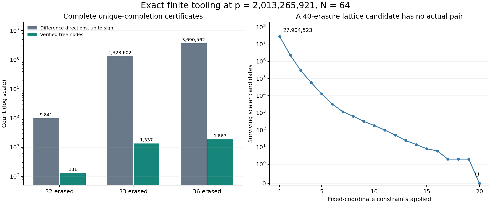

# Round23: compressed covers and actual orbit intersections

**New finite guarantee:** on the saved p=2013265921,N=64 encoding, any36 consecutive cyclic erasures leave at most one completion from the remaining28 digits. Round22 established this for32 erasures. The complete decoder has a27648-combination cap at36; a proof of uniqueness does not itself construct the candidate.

**New limitation identified:** an explicit40-erasure difference passes the full integer lattice, coordinate-height and scalar-congruence checks, yet no two actual words realize it. Two separate implementations exhaust27904523 possible scalar pairs for that target and return zero. The missing information is simultaneous scalar-orbit realizability, beyond the retained geometric constraints.

Neither result proves either prize. Historical worldwide novelty remains unestablished; the [prior-art audit](prior_art.md) identifies existing branch-and-bound certificates, LP duality and hidden-number formulations.



## The implemented tools

[box_cover.py](box_cover.py) covers nonzero integer difference vectors with a tree of boxes. Each discarded or narrowed region has an exact rational-cut justification; each split is a disjoint exhaustive integer partition. [cover_review.py](cover_review.py) independently checks the arithmetic, root coverage, every narrowing step, every child and all unresolved leaves. Search budgets preserve explicit unresolved regions.

[resume_cover.py](resume_cover.py) reuses the saved tree and cuts. The initial33-erasure run left one point unresolved. Reapplying later cuts removed it with no new cuts or nodes. [Independent refinement review](refinement33_review.json) checks all5620 narrowing steps and preservation of1336 previously finished nodes. The same resaturation at40 erasures leaves its19 unresolved regions unchanged.

[orbit_intersection.py](orbit_intersection.py) counts actual scalar pairs satisfying fixed centered-coordinate differences. It enumerates the tightest coordinate interval, which parameterizes possible scalars bijectively, then filters the remaining constraints. The [independent reviewer](orbit_review.py) enumerates the other member of the pair and compares actual centered differences rather than using the producer's interval test.

## Complete and incomplete coverage

| Consecutive erasures | Nonzero difference representatives, up to sign | Tree nodes | Rational cuts | Final guarantee |
|---|---:|---:|---:|---|
| 32 | 9841 | 131 | 21 | Unique completion |
| 33 | 1328602 | 1337 | 64 | Unique after resaturation |
| 36 | 3690562 | 1867 | 64 | Unique completion |
| 40 | 219726562 | 2021 | 64 | Incomplete:19 unresolved leaves |

The40-erasure leaves contain177723199 integer representatives under the current bounds. These are possible lattice-coordinate differences, not actual codeword pairs. One rational continuous witness survives; its associated target is separately shown unrealizable by the orbit counter. This excludes one target up to sign, not the full remaining domain.

The [preflight decoder review](preflight_review.json) checks eight new scalar anchors and their bounded edits at each of33,36,40 erasures. All16 queries complete at33 and36, yielding8 singletons and8 empty lists. At40,10 queries exceed the50000-candidate budget; the other6 yield1 singleton and5 empty lists. Their uniform candidate caps are12288,27648,708588 respectively. Sample success is kept separate from universal guarantees.

## An explicit gap in the geometric model

The40-erasure visible target is(1,0,...,0), with scalar difference345549834. The saved inverse basis has27 invisible directions equal to signed p-multiples of the first27 coordinate units. Thus this target fixes the remaining37 inverse-image coordinates while permitting integer carries in the first27.

Any actual pair with the target must satisfy37 exact orbit constraints. Coordinate62 is tightest: its centered value must lie in[978728438,1006632960], giving27904523 candidates. The counts after successive filters include2323145,293452,57694,...,2,0. Both implementations check the complete seed interval and agree that there are no actual pairs.

The [integral gap certificate](gap_certificate.json) goes beyond a fractional counterexample. It supplies an integer lift H with |H_i|<=p-1 and H_i=345549834*g^i modulo p. The associated digit difference fH/p is integral, supported on the erased40 coordinates, has maximum coefficient magnitude4, and has integer coordinates in the full erasure lattice. Nevertheless its visible target has no actual pair. The [separate review](gap_review.json) verifies these properties and binds the complete orbit count.

The [derivation](DERIVATION.md) proves the pair-count equivalence, cyclic transport, covering rules and scope. At40, adding more valid inequalities from the same relaxed body cannot remove its feasible target. The orbit condition supplies information that body omits.

## Run the checked36-erasure query

The saved [input](erasure36_input.json) erases36 cyclic coordinates starting at57. The [output](erasure36_output.json) recovers scalar1234567 and reports the verified covering guarantee.

```sh
/opt/miniconda3/bin/python3 tooling_lab/round23/cover_query.py \
  --certificate tooling_lab/round23/consecutive36.json \
  --cover tooling_lab/round23/cover36.json \
  --input tooling_lab/round23/erasure36_input.json \
  --cyclic-start 57
```

Inputs contain integers and null erasures. An incomplete cover is reported as incomplete; it is not interpreted as nonuniqueness. Enumeration can also exceed its budget even when uniqueness is certified. [CLI controls](query_review.json) exercise both distinctions, an all-erased17-completion example, and rejection of missing root coverage. Eight33-erasure cyclic controls use36 scalar candidates in total; the [36-erasure CLI check](query36_review.json) independently constructs its expected word.

## Verification and remaining work

- Initial covering review:5748 nodes,298 cuts and24238 exact narrowing steps across four large and seven small covers. Every one of550 genuine small ambiguity pairs survives in an unresolved leaf. Four corrupted covers are rejected.
- Preflight review:48 queries,109 conditioned cuts and109 exact optimality certificates;225813 scalar candidates checked.
- Inverse-basis information review:177 rows across five large geometries and two degenerate controls. The large rows are integral and scalar-congruent; the controls show why this is not automatic for every relation.
- Orbit review:3344 complete small intersections checked against246928 direct scalar-pair tests, plus all27904523 large candidates for one target.
- Gap review: full integer-lattice and64 scalar-congruence checks, linked to the zero actual-pair count; two corrupted gap certificates rejected.
- Refinement reviews check complete33 and still-incomplete40 covers while preserving earlier work. All numerical jobs are terminal; the [manifest](manifest.json) binds artifacts and preserves round22 and the earlier checkpoints.

Reviews are separately implemented root-run checks, not human review or Lean certification. Child agents remained unavailable after the earlier usage/authentication failures; no reset was used. Both proof projects remained read-only, with no builds, commits or submissions.

The next steps are to compile direct physical-coordinate cuts from the inverse basis, which may avoid much LP discovery, and to build certificates for groups of orbit-intersection targets. Scattered erasure geometry, norm estimates and ambient proximity discovery remain open. The [active checkpoint](../NEXT_ITERATION.md) records the next concrete experiments.
