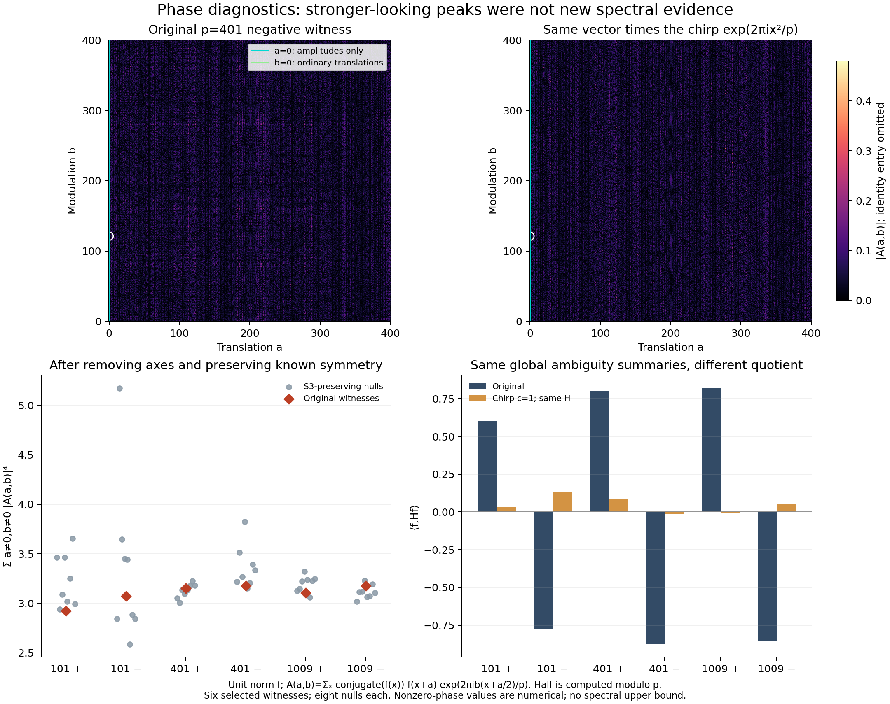

# Third iteration: test the new tools' own blind spots

The second round made several previously impractical calculations possible. This round asks whether the information they compute is sufficient for their intended diagnostic use. Two new counterfactual instruments now give checkable failures of specific interpretations.

## Identical energy data, different higher-order distributions

The [paired-row counterfactual auditor](pair_type_twins/README.md) constructs the standard Paley49 and Peisert49 matrices in an explicitly checked field. They have identical aggregated pair-type data. A short [universality proof](pair_type_twins/universality.md) shows that this forces equality of every Johnson harmonic L2 energy in the class under consideration.

Nevertheless, their sixth-kernel distributions differ. Complete enumeration covers13,983,816 six-element sets; a separate ordinary-product implementation independently reproduces every marginal and joint bin using translation reduction. Both graphs have the same extrema, -29 and27, but different frequencies at those extrema. Thus the retained data do not determine the full distribution. This does not preclude a useful common upper bound.

This directly audits the fast compiler built in round two. Its exact high-order energy answers are useful, but they retain only pair-type information. Any attempt to infer more arithmetic from them must add a new input that these twins do not share. The graphs, their construction and their nonisomorphism are known; the exact diagnostic pairing and certificate are a local contribution with historical priority unestablished.

## Richer phase data, misleading generic summaries

The [phase transport microscope](phase_transport/README.md) computes full finite Weyl ambiguity planes for six selected near-edge witnesses through p=1009. It validates ordinary translations exactly and nonzero phases numerically, with direct complex sums, group identities, chirp/Fourier covariance, Wigner marginals, and generic complex-vector controls.

Every strongest phase-plane overlap lies on the pure-modulation axis, where it measures amplitudes. Every strongest projective line is also an amplitude statistic. A first apparent off-axis fourth-moment excess largely disappears when the comparison vectors preserve the known S3 action.

At p=401, multiplying a witness by a chirp preserves the tested global phase summaries but changes its quotient for the fixed Paley operator from approximately -0.87749 to -0.01302. This is a numerical complex-vector comparison, independently replayed by scalar summation. It shows those summaries cannot suffice to recognize a large quotient for that fixed operator. It does not rule out a necessary condition, all phase information, or a feature that also uses operator alignment.

The new reusable interface exposes full phase data and the invariance controls needed to avoid false signals. Weyl/Wigner mathematics and chirps are established; the experiment does not claim to invent them.

## What this changes about the next iteration

The missing information is becoming more specific:

- Global paired-row averages erase some higher-order distributional behavior even when calculated exactly.
- Phase summaries invariant under chirps can erase the alignment with the particular operator whose edge matters.
- The complete coding census from round two still needs a way to certify whole support or track families without enumerating exponentially many bases.

The next prototypes should retain a specified arithmetic mark or higher-row configuration, test a phase feature tied to the operator, or certify a batch of coding supports. Each must be checked against these exact counterfactuals and against target leakage: merely rewriting the quantity to be bounded does not provide a new estimate.

The [second-round report](../round2/README.md) contains the scaled computations and coding/arithmetic tools. This round's mathematical scope is finite diagnostic evidence, with neither prize proof attempted and no historical novelty claim established. [Independent twin review](novelty/twins_review.md) and [independent phase review](phase_transport/root_review.json) record the checks.
