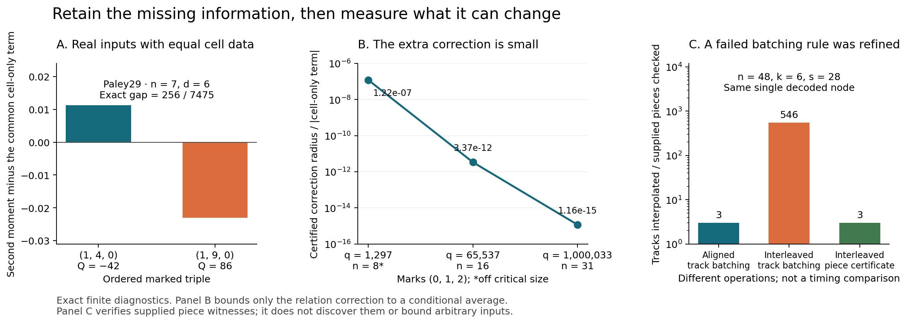

# Fourth iteration: identify, compress and limit the missing information

This round turned the previous information-loss tests into two executable refinements. The Paley instrument now retains arithmetic marks, discovers that three marks need one extra contraction, and computes it exactly through a million-point field. The coding instrument certifies whole interpolation batches, then handles an interleaved failure using a separate scalar-fiber certificate. Both refinements have independent finite checks and explicit cases where the new information or compression is insufficient.

No prize proof was attempted. Historical novelty is not established. The [source audit](novelty/prior_art.md) identifies established conditioning, Walsh, rooted-graph, interpolation and decision-diagram methods, as well as directly overlapping local work. The local contributions are precise compiler interfaces, derived specializations, exact witnesses and tested certificates.



## 1. Arithmetic conditioning exposes a missing contraction

For `T_d(C)=sum_x e_d(S[x,C])`, the new compiler calculates exact mean and second moment over all n-sets containing chosen marks. It groups the known conference row-pair types, keeps marked factors fixed and assigns each distinct outside column its exact inclusion probability. This avoids enumerating all input sets.

The first control changed the experiment: when n=d, marked cell sizes alone determine the second moment. A six-point test would not establish the value of additional cell relations. At n7/n8, actual Paley29 triples **(1,4,0)** and **(1,9,0)** have identical complete signed cell-size profiles and different second moments. Two more actual pairs include a Paley49/Peisert49 comparison. Independent enumeration checked6,363,136 completions across the three pairs.

For three marks, Walsh expansion and the conference identities reduce all additional relation information to one integer

```
Q = h2^T S h3,
h2 = sum of the three pair-products of marked columns,
h3 = product of the three marked columns,
both vectors set to zero on the marked rows.
```

The exact second moment is `B(cell sizes)+c(q,n,d)*Q`. At Paley29,n7,d6, B is941207/7475 and c is−2/7475. The two triples have Q=−42 and86, explaining their moment difference256/7475 exactly. This is a finite insufficiency witness for cell-size data and a sufficient replacement interface for this conditional second moment.

The full counting backend uses17 NTT transforms for the eleven-cell large examples. The reduced backend uses3 transforms for one convolution, plus field-linear construction of the cell histogram. It reproduces the full compiler through q1,000,033. Exact transform-length and centered-integer-recovery guards are enforced. Field arrays still require memory proportional to q; only the final coefficient computation is independent of enumerating field elements or sets.

The reduction also makes its limitation quantifiable. The ordinary conference norm bounds Q and therefore the possible correction cQ. Relative to B, the exact outward-rounded envelope is below3.4×10⁻¹² at q65537,n16 and1.2×10⁻¹⁵ at q1,000,033,n31 for the displayed three-mark data. Greater descriptive precision does not automatically give a large change in this average. This bound concerns only the relation correction, and says nothing about exceptional individual sets.

A further [symbolic coefficient analysis](coefficient_structure/README.md) derives c(q,n,6) exactly from a polynomial recurrence, with no empirical fitting. Eight endpoint factors and a quartic explain its zeros and sign reversals. At n asymptotic to alpha·q^(1/4), c is asymptotic to −alpha^4/q². Combining this with the conference norm gives an absolute correction bound `(sqrt(3)*alpha^4+o(1))/sqrt(q)`, uniformly over actual three-mark conference inputs. The coefficient behaves differently at positive sampling density, so the small-effect conclusion needs its stated growth regime. This is a bound on this conditional-average correction, not a bound on the target at individual sets.

Read the [compiler and derivation](marked_moments/README.md), [actual ablations and optimized convolution](marked_counts_ablation/README.md), and [independent mathematical review](novelty/README.md).

## 2. Whole interpolation families receive finite certificates

The coding census previously interpolated every selected k-basis in a complete covering family. Many bases can reconstruct the same polynomial pair(A,B), hence the same affine codeword track. A zero-suppressed decision diagram now removes all remaining bases inside that track's common agreement set without enumerating them.

The certificate is independent of the diagram: two different degree-less-than-k polynomial pairs cannot agree simultaneously on k coordinates. Their certified basis families are disjoint. Backing each track by an input basis and summing the exact covered-basis counts proves completeness when the sum equals the full cover size. Scalar buckets then retain every qualifying scalar, full codeword and maximal agreement support, including symbolic whole-field cases.

This gives three interpolations for deliberately aligned examples whose selected cover has approximately3.57×10⁴⁷ bases at n1024,k64,s410. The gain is conditional on structure. Generic cases and existing hard coset inputs retain almost every track. Interleaving the same three polynomial pieces destroys the small n48 speedup: the track count rises from3 to546 while the final decoded node remains the same.

The first pruning refinement reduced recursive visits but did not improve generic benchmark times. That negative result is retained. See [symbolic interpolation batches](support_batches/README.md).

## 3. The failed interleaved case leads to a scalar-fiber certificate

The next prototype uses a known linear-code symmetry already present in the local research. If the input pencil passes through an exact codeword f at scalar z*, then every non-anchor scalar is equivalent, by translation and nonzero scaling, to list decoding the direction word. The mapping retains the complete codeword and maximal support; it does not merely count scalar events.

Finding the codeword intersection uses two interpolants and exact residual equations. A separate supplied piece-polynomial partition certifies the direction's complete list: if r pieces cover the coordinates and `s>r(k−1)`, every qualifying degree-less-than-k polynomial must be one of the distinct piece polynomials. Each candidate's full agreement support is then checked. The tool verifies the supplied pieces; it does not solve the general piece-discovery problem.

This certificate handles both aligned and interleaved n48 inputs using3 piece checks. At n1024 it certifies an interleaved one-node case with3 pieces. A different2-piece case represents131,073 scalar/codeword nodes with two non-anchor fibers and one anchor. An additional GF(3⁶) example exhaustively checks all531,441 scalar/constant-codeword pairs.

The event here is **plain closeness to a codeword**. The Proximity Prize's separate non-jointness/event obligations are not imposed. Inputs without an exact codeword intersection or a verified static list need a different method. Read [scalar-fiber transport and its local prior art](scalar_fibers/README.md).

## What this changes for the broader research

These prototypes improve the ability to state and test a proposed mechanism. They do not supply the missing uniform estimate. The Paley branch now has an exact example of the information omitted by an arithmetic cell histogram, a one-number sufficient replacement for a specific average, and a bound showing how little that number can alter selected critical-size averages. The coding branch can certify large structured pencils without basis enumeration, while exposing precisely which structure it needs.

The next useful step is not another undirected size scan. The [next-iteration proposal](../NEXT_ITERATION.md) targets a higher distributional moment that the earlier equal-L2 Paley/Peisert pair already distinguishes, and seeks certificates whose structural witnesses can be found on less tailored coding inputs. A bounded prior-art audit remains part of every proposed extension.

## Evidence and reproduction

Independent review includes2,454 conditional-moment records; generic-degree and boundary checks; direct contraction identities and envelopes;261 complete polynomial/scalar comparisons for symbolic batching; and1,700 independent comparisons for scalar fibers. The [review directory](novelty/README.md) distinguishes direct enumeration, exact readback and shared helper code. The large full-graph counts have full small-field checks and sampled independent large-row checks, not a second full million-field enumeration.

```sh
python3 tooling_lab/round4/verify_round.py
python3 tooling_lab/round4/plot_results.py
```

The round verifier checks saved evidence against current source and input hashes, validates exact cross-lane equalities and documentation links, then writes a new manifest. Individual lane READMEs contain the commands for recomputing the experiments. [overview.pdf](overview.pdf) is the standalone figure. The [verification log](verification.log) and [manifest](manifest.json) identify the final artifact snapshot.

All mathematical implementation work is under `tooling_lab`. The original proof research and proximity checkout remain read-only inputs. One prior round3 README was refreshed during lane recovery; [its recorded documentation-only manifest amendment](prior_snapshot_amendment.json) confirms that every other round3 artifact was unchanged.
