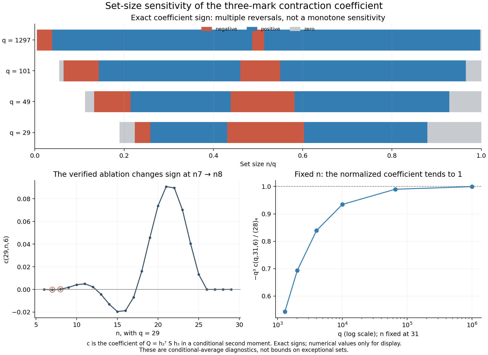

# Exact structure of the three-mark sensitivity coefficient

The coefficient multiplying the additional contraction is a degree-12 polynomial in the chosen set size, with eight explicit endpoint factors and a quartic controlling the remaining sign changes. We derive its general formula by an exact generating-polynomial recurrence, **not by fitting sampled values**. Every valid set size was then checked against the general compiler at seven q values, including all n through q=1297.

This explains the verified Paley29 reversal between n7 and n8 and several further reversals. It also separates the growth regimes: the coefficient decays for fixed n or fourth-root-sized n, but need not decay when n is proportional to q. The result concerns a conditional-average diagnostic. It is not a worst-case bound on exceptional sets or a prize proof, and historical originality has not been established.

## Definition and domain

The parent three-mark reduction writes
\[
\mathbb E[T_6(C)^2\mid M\subset C]
=F_{q,n}(\text{cell sizes})+c(q,n,6)Q_M,
\quad Q_M=h_2^TSh_3.
\]
Here \(h_2=\sum_{i<j}S_{x,m_i}S_{x,m_j}\), \(h_3=\prod_i S_{x,m_i}\), and both are zero on the three marks. The underlying matrix is symmetric, has diagonal zero and off-diagonal signs ±1, and satisfies \(S1=0\), \(S^2=qI-J\). The conditional compiler and the reduction remain unchanged in their frozen directories.

This lane specializes to **degree six and exactly three marks**, q≥17 with q≡1 mod4, and 6≤n≤q. The helper `contraction_coefficient_degree6(q,n)` deliberately has no generic degree parameter. It must not be substituted into the odd-degree API or silently extended to q13. The algebra also makes sense at formal q values where no matrix has been supplied; it does not assert matrix existence there.

Write r=n−3, and use falling factorial notation \((x)_k=x(x-1)\cdots(x-k+1)\). The coefficient is the Walsh projection indexed by I={0,1}, J={0,1,2} of the difference between the two mutual-sign pair kernels:
\[
c=\frac1{64}\sum_{a,b\in\{\pm1\}^3}
a_0a_1b_0b_1b_2\bigl(K_+(a,b)-K_-(a,b)\bigr).
\]

## General formula

An exact falling-factorial formula is
\[
c(q,n,6)=\sum_{k=4}^{12}G_k(q)\frac{(r)_k}{(q-3)_k},
\]
with the following fully explicit polynomials:

| k | G_k(q) |
|---:|:---|
| 4 | 25−q |
| 5 | 16(q−23) |
| 6 | (q²−228q+4435)/2 |
| 7 | −4(q²−109q+1800) |
| 8 | 13q²−969q+13908 |
| 9 | −2(11q²−646q+8251) |
| 10 | (41q²−2040q+23647)/2 |
| 11 | −2(5q²−220q+2351) |
| 12 | 2(q−21)(q−19) |

The coefficients for k=0,1,2,3 vanish. Factoring this expression gives
\[
\boxed{c(q,n,6)=-\frac{(n-3)_4(q-n)_4\,P(q,n-3)}{2(q-3)_{12}}},
\]
where \(P(q,r)=a_4r^4+a_3r^3+a_2r^2+a_1r+a_0\), and
\[
\begin{aligned}
a_4&=-4(q-21)(q-19),\\
a_3&=4(q^3-52q^2+715q-1792),\\
a_2&=-q^4+87q^3-1689q^2+8537q-13846,\\
a_1&=-15q^4+445q^3-3683q^2+13299q-19838,\\
a_0&=2q^5-74q^4+942q^3-6158q^2+21760q-32984.
\end{aligned}
\]

`closed_coefficient.py` evaluates this formula using integers and `Fraction`. `symbolic_formula.json` retains the unfitted derivation data and a factored symbolic expression; `fixed_q_polynomials.json` contains the original q29,49,101,1297 factorizations.

## Why this is a symbolic derivation

For a paired row and an unmarked column type (a,b), write
\(1+z(at+bu+abtu)\). Marked columns instead contribute the fixed factors \((1+at)(1+bu)\). The coefficient of z^k records k distinct unmarked columns; replacing it with \((r)_k/(q-3)_k\) supplies the inclusion probability.

Increasing q by 4 increases each of the four nonzero paired-column multiplicities by exactly one. It leaves the two zero-site types and the marked factors unchanged. Consequently the complete marked generating polynomial, and hence its Walsh projection W, obey
\[
W_{17+4h}(t,u,z)=W_{17}(t,u,z)B(t,u,z)^h,
\]
where h≥0 is an integer and
\[
\begin{aligned}
B&=\prod_{a,b=\pm1}\bigl(1+z(at+bu+abtu)\bigr)\\
 &=1-2z^2(t^2+u^2+t^2u^2)+8z^3t^2u^2\\
 &\quad+z^4\bigl((t^2u^2-t^2-u^2)^2-4t^2u^2\bigr).
\end{aligned}
\]

We truncate at t-degree6, u-degree6 and z-degree12. The latter is justified because at most twelve distinct columns can contribute to a product of two degree-six coefficients. Every nonconstant term of B has z-degree at least2, so
\[
B^h\equiv\sum_{j=0}^6\binom hj(B-1)^j
\quad\text{within this truncation.}
\]

This is a finite exact identity, with a justified cutoff. The program constructs the full W17 by literal marked/unmarked type multiplication, then computes the seven coefficient arrays
\[
T_{j,k}=[t^6u^6z^k]\,W_{17}(B-1)^j.
\]
It obtains \(G_k(q)=\sum_{j=0}^6\binom{(q-17)/4}{j}T_{j,k}\). The general construction bounds the q-degree by floor(k/2); exact cancellation makes every projected row with j≥3 vanish, leaving the displayed quadratic polynomials. The computer algebra factors and checks polynomial identities exactly. No polynomial interpolation or numerical inference is used in this derivation.

An independent agent reconstructed W17 with individual column factors and verified all seven binomial arrays, including the cancellations, as well as the common factor B and the final factorization. Its separate artifacts live in `round4/coefficient_structure_review/`.

## Exact roots and sign changes

As a polynomial in r, c has degree12 over the rational-function field in q. The leading coefficient is \(2(q-21)(q-19)/(q-3)_{12}\). Thus degree12 holds at the four requested q values and throughout the stated arithmetic progression except q21, where the formal specialization has degree11. q19 is outside q≡1 mod4. This exception is recorded rather than concealed as a universal degree claim.

Eight exact roots come from n=3,4,5,6 and n=q−3,q−2,q−1,q. The first three lie below the degree-six API domain. All remaining roots are exactly the roots of the displayed quartic. `all_n_validation.json` gives rational isolating intervals of width at most 10⁻¹⁰ for every real quartic root, including those outside the valid set-size interval. These intervals define algebraic roots exactly; decimal centers are supplied only for orientation.

For the four requested q values, the integer signs are:

| q | negative n ranges | positive n ranges | integer zeros in 6≤n≤q |
|---:|:---|:---|:---|
| 29 | 7; 13–17 | 8–12; 18–25 | 6; 26–29 |
| 49 | 7–10; 22–28 | 11–21; 29–45 | 6; 46–49 |
| 101 | 7–14; 47–55 | 15–46; 56–97 | 6; 98–101 |
| 1297 | 7–50; 632–666 | 51–631; 667–1293 | 6; 1294–1297 |

The additional q25 test has an extra integer root at n7. Two useful low-cardinality formulas make the original sign reversal transparent:
\[
c(q,7,6)=-\frac{24(q-25)}{(q-3)_4},\qquad
c(q,8,6)=-\frac{120(q^2-48q+543)}{(q-3)_5}.
\]
They give \(c(29,7,6)=-2/7475\) and \(c(29,8,6)=2/16445\). The same exact difference in Q therefore contributes with opposite signs. More selected columns do not imply monotone sensitivity to Q.



## Size regimes and the fourth-root regime

All five limits below were verified symbolically from the exact rational formula in `sensitivity.py`.

For fixed n≥7,
\[
c(q,n,6)\sim-\frac{(n-3)_4}{q^3}.
\]
More generally the same leading form holds when r=o(√q), with the usual interpretation when r grows. In particular, for fixed α>0 and n/q^(1/4)→α,
\[
c(q,n,6)\sim-\alpha^4q^{-2}.
\]

This yields a uniform absolute bound on the **particular scalar conditional-average correction**, using only conference identities. Let e12,e13,e23 be the three mark-edge signs and
\(L=e12e13+e12e23+e13e23\in\{3,-1\}\). Directly,
\[
\|h_2\|^2=3q-15-2L\le3q-13,
\qquad\|h_3\|^2=q-3,
\qquad\|S\|=\sqrt q.
\]
Hence
\[
Q_M^2\le q(q-3)(3q-13)<3q^3,
\]
and, uniformly in the three marks,
\[
\boxed{|cQ_M|\le(\sqrt3\,\alpha^4+o(1))q^{-1/2}
\quad\text{when }n\sim\alpha q^{1/4}.}
\]
For completeness, the norm identity follows from h2²=3+2h2 off M and \(\sum h_2=-3-L\), obtained by subtracting the marked rows from the column inner products −1. This argument and the joint scaling were independently reviewed. It bounds neither the cell-only term nor exceptional subsets. No relative asymptotic bound is inferred without a suitable positive lower bound on the baseline being compared.

Other regimes differ:

| regime | exact leading limit |
|:---|:---|
| r=λ√q, λ fixed | qc → λ⁴(λ²−2)/2 |
| n=αq, 0<α<1 fixed | c/q² → α⁶(1−α)⁴(1−2α)²/2 |
| n=q/2+β√q, β fixed | c/q → (β²−1/4)/512 |

The first limit locates the initial sign transition near n≈√(2q)+3. The last shows a negative sensitivity window near the middle, of width approximately √q. Thus saying that the coefficient always becomes tiny would be false; the scaling of n must be stated.

In the saved finite case p=1,000,033, n31, Q=−571662, the coefficient is approximately −4.91024×10⁻¹³ and its contribution cQ is approximately 2.80700×10⁻⁷. The computed full second moment is approximately 7.36190×10¹¹, so the contribution is 3.81287×10⁻¹⁹ of that particular positive second moment. This last ratio is an exact-data observation about one case, not a relative asymptotic bound or a statement about the total effect of conditioning on the marks. The exact fractions and a conference-Cauchy bound are in `sensitivity.json`.

## Validation, reproduction, and limits

`verify_all_n.py` checks every 6≤n≤q at q17,21,25,29,49,101,1297: **1,504 exact cardinality comparisons**, plus full Walsh reconstruction checks at representative n. It evaluates the general compiler's weighted pair coefficients directly, rather than reusing the new G_k array as its oracle. It also verifies symbolic equality of the factored closed formula. All checks passed in 146.74 seconds on the recorded run. q21 is a formal algebraic specialization, not an asserted conference graph.

Run these commands in this directory with `/opt/miniconda3/bin/python` (Python3.13.2, SymPy1.14.0):

```sh
OPENBLAS_NUM_THREADS=1 /opt/miniconda3/bin/python coefficient_polynomial.py
OPENBLAS_NUM_THREADS=1 /opt/miniconda3/bin/python symbolic_formula.py
OPENBLAS_NUM_THREADS=1 /opt/miniconda3/bin/python verify_all_n.py
OPENBLAS_NUM_THREADS=1 /opt/miniconda3/bin/python sensitivity.py
OPENBLAS_NUM_THREADS=1 /opt/miniconda3/bin/python plot_sensitivity.py
```

The figure was rendered with NumPy2.4.5 and Matplotlib3.10.3 and visually inspected. Symbolic and validation outputs carry source hashes. The independent review supplies an additional implementation of the polynomial expansion; none of these artifacts is a Lean formalization. The mathematical recurrence and finite degree cutoffs explain why the symbolic result applies generally in its stated domain.

The new local outcome is an exact explanation and a compact evaluator for the conditional diagnostic's sign and scale. Walsh expansion, generating functions, falling factorials, and conference norm bounds are known techniques. We make no claim that this specialization has never appeared in the literature, and it does not settle either prize problem.
