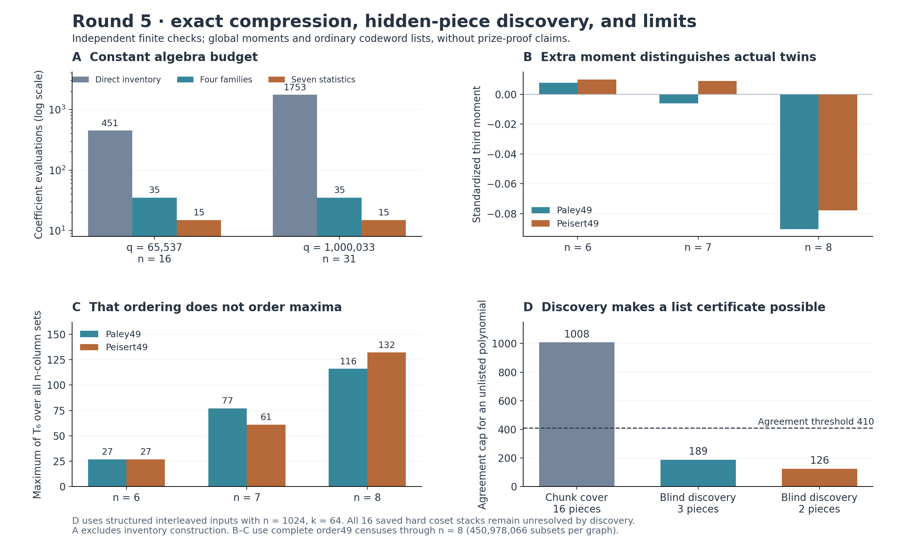

# Round 5: seven trace statistics and discovered polynomial pieces

This iteration closes two concrete tooling gaps from round4. It compiles exact global third moments for column sets larger than six, and it discovers the hidden polynomial-piece witnesses that the coding certificates previously required as inputs. Repeated refinement reduces the graph calculation from35 coefficient evaluations to15. Both branches have independent exact checks and explicit failure examples.

The continuing objective is mathematical tools for the underlying problems. Neither prize is proved, and historical uniqueness is not established. The [next iteration](../NEXT_ITERATION.md) is already testing how much arithmetic information the new moment adds and removing the coding certificate's exact-anchor requirement.



## What is now executable

| Tool | New capability | Evidence and limit |
|---|---|---|
| [General third-moment compiler](third_moment/README.md) | Computes `E[T6(C)^3]` over uniform n-column sets from a normalized row-triple inventory, retaining all union sizes and repeated rows. |80 independent exact comparisons, including complete order49 censuses through n8. It is an average, not a maximum bound. |
| [Exact prime trace backend](trace_backend/README.md) | One cyclic character convolution exports the complete cubic-trace array and joint edge/trace inventory. |Through p1,000,033; full direct sums through1297,33 direct rows at each large prime, and full-array consistency checks. Large traces are not all independently recomputed. |
| [Symmetry and seven-statistic adapters](trace_invariants/README.md) | Folds four edge classes into two residue classes, then consumes seven measured integers with15 coefficient evaluations. |All14 saved graph/size cases agree exactly. The statistic contract requires independently justified normalization, and does not certify graph realizability. |
| [Blind piece discovery](piece_discovery/README.md) | Finds low-degree polynomial covers from the word, verifies exact rank/factor witnesses, and feeds complete static/scalar certificates. |Hidden interleaved n1024 fixtures succeed;805 tiny minimum-cover sizes are independently checked. All16 saved hard coset stacks remain unresolved. |

Here `T6(C)=sum_x e6((S_xy)_(y in C))` for the conference sign matrix S. The actual Paley49 and Peisert49 matrices have identical earlier global second-moment information, while their third moments differ. The exact compiler therefore retains information that the previous representation lost.

## The mathematical refinement

For three distinct rows define the mutual edge signs e01,e02,e12, their cubic sign correlation tau, and

```
theta = e01*e02*e12*tau.
```

Row permutations and global complementation leave theta invariant. Their two triangle classes are monochromatic and mixed. The full theta histogram already encodes which class a bin belongs to: its residue modulo8 is respectively `15−q` or `q−7`. These residues differ by4. The family label can be reconstructed, although aggregating ordinary moments can discard it.

At fixed q and class the row-triple product expectation is a polynomial in theta of degree at most6. The union-generating product proves more: its theta5 coefficient is zero, and its theta6 coefficient before inclusion is universally

```
(z−3z²+2z³)^6 / 720.
```

Both remaining polynomials are quartics. Five exact evaluations determine each, a sixth checks it, and three repeated-row evaluations remain:15 total. This argument is algebraic; extra-node tests are implementation checks.

Let A_j be the monochromatic theta power sums, B_j the mixed sums, and M_j=A_j+B_j. Conference identities determine the zeroth sums, impose `B1=3*A1−6` and determine `A2+B2`. Only seven measured quantities remain:

```
A1, A2, A3, B3, A4, B4, M6.
```

Equivalently, use four ordinary theta moments and three moments weighted by the class's modulo8 character. Exact coefficient rank is seven at each tested q49,101,1297 after those identities. That is a statement about the formal linear model, not minimality over actual graphs.

The [independent derivation](review/fold_review.md) isolates where the n6 shortcut first fails. If Delta_k is the monochromatic-minus-mixed raw union coefficient, Delta6=0 while

```
Delta7(q,theta) = −q²+2q*theta²−32q*theta+44q
                  −theta⁴/3+32theta³/3−134theta²/3+1024theta/3−323.
```

At n7 its inclusion factor is `1/binom(q,7)`. The general class correction first appears at union size7. At q1297 both actual class supports are large enough to rule out one common degree-six polynomial even on the actual parameter values. This does not provide two actual graphs with equal ordinary theta moments and different targets; that stronger claim remains unestablished.

## Discovery replaces supplied coding witnesses

The coding prototype solves a monic polynomial-reconstruction system for a complete r-piece cover, with exact rank and dual inconsistency certificates. Bounded simple-root lifting proposes degree<k branches; full polynomial identities and coordinate coverage verify them. A strict root-count cap then certifies the entire ordinary agreement list.

The n1024,k64,s410 interleaved three-piece and two-piece inputs now work without revealing their labels or coefficients. The certified minimum cover sizes are3 and2. Their unlisted-polynomial agreement caps are189 and126, below410; the simple16-piece chunk baseline has cap1008 and cannot certify that threshold.

This is a restricted discovery method. Inconsistent smaller systems plus a successful cover prove its minimum piece count. An underdetermined relation space with failed factor recovery does not prove that a useful cover is absent. The saved hard examples expose exactly that unresolved search, as well as the absence of an exact codeword anchor. A separate tiny failure has polynomial factors that collide at every base-field lifting center.

## What the checks establish

The [third-moment review](review/README.md) uses independently constructed finite matrices and literal column/subset algorithms. The order49 origin-slice double count certifies all13,983,816 six-sets,85,900,584 seven-sets and450,978,066 eight-sets in each graph. It does not require free translation orbits.

The [folding review](review/fold_review.md) independently checks the symmetry and universal-coefficient proofs, exact adapters, exceptional S3 orbits, malformed inputs and the first class-difference polynomial. The [piece-discovery review](review/piece_discovery_review.md) checks928 tiny cases,1962 ranks,930 dual inconsistency witnesses,793 complete static lists and164 scalar-fiber oracles. A separate large replay verifies both n1024 certificates without reusing the production linear solver or factor verifier.

The new average still does not order maxima. Peisert49 has the larger raw third moment at both n7 and n8. Its maximum is61 versus Paley's77 at n7, but132 versus116 at n8. This finite failure is retained as a control for future proposals.

## Provenance and reproduction

The [manifest](manifest.json) and `verification.log` bind final source/input bytes and the saved independent evidence. The fast integration audit also checks that all151 artifacts pinned by round4 remain unchanged. It does not re-enumerate the large censuses or recompute the large convolution; each lane documents its complete replay commands.

```
/opt/miniconda3/bin/python3 tooling_lab/round5/verify_round.py
/opt/miniconda3/bin/python3 tooling_lab/round5/third_moment/run_experiments.py
/opt/miniconda3/bin/python3 tooling_lab/round5/trace_invariants/run_residue_experiments.py
/opt/miniconda3/bin/python3 tooling_lab/round5/piece_discovery/run_experiments.py
```

The two early `third_moment/scale_p*_n*.json` records retain their original source hashes and are explicitly historical first runs. Final-source claims use `third_moment/results.json` and the later refinement records. Sources, input inventories, executable hashes, exact rational values, operation counts and measured timings are retained. The [standalone figure PDF](overview.pdf) is generated from saved results.

The [preflight literature ledger](preflight/README.md), the [third-moment audit](review/README.md), and the [coding attribution](piece_discovery/README.md#prior-art-boundary) identify close primary and local prior art. Newton identities, Krawtchouk coefficients, finite-population moments, Legendre traces, interpolation, polynomial reconstruction and Hensel lifting are established. The specific tested identities, interfaces, certificates and failure examples are the local research contribution; a bounded search cannot prove that an approach has never been tried.
