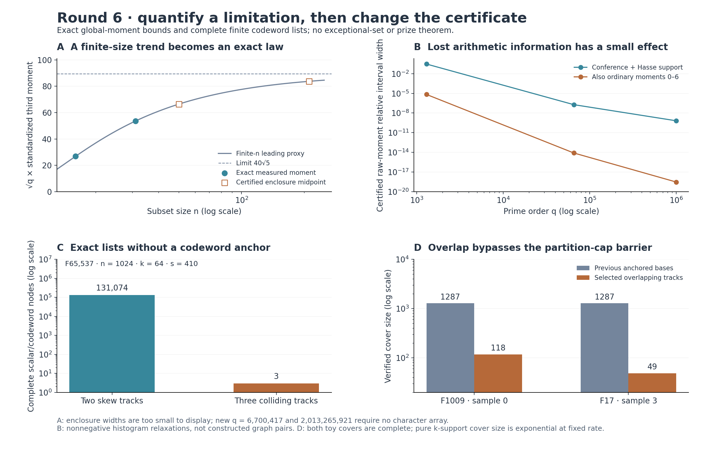

# Round 6: exact information limits and changed certificates

This completed iteration explains why one successful graph diagnostic has little sensitivity to arithmetic at critical size, and bypasses a proved obstruction to one coding certificate family on two hard toys. The next iteration studies individual inputs. Neither prize is proved; historical originality remains unestablished.



| Tool | Completed result | Practical limit |
|---|---|---|
| [Rational trace envelopes](trace_envelopes/README.md) | Exact primal/dual certificates measure the range of global third moments under conference identities, Hasse support and optionally ordinary trace moments. | Relaxed rational histograms need not be realized by graphs; global averages do not bound individual sets. |
| [Critical-size moment algebra](critical_third/README.md) | Exact polynomial compilation identifies the universal leading term and bounds the arithmetic correction. Queries at q=2,013,265,921 require no character array. | The proved asymptotics concern one global statistic, with n approximately alpha q^(1/4). They imply no central limit theorem or exceptional-set bound. |
| [Pencils without codeword anchors](pencil_tracks/README.md) | Blind discovery and symbolic certificates give complete whole-field lists on selected n=1024 inputs with no exact anchor. | Discovery and the strict root-count cap can fail. Ordinary agreement lists remain separate from the official MCA event. |
| [Partition-certificate obstruction](cover_barriers/README.md) | Exact maximum joint agreement rules out every affine-track partition certificate on all16 saved hard pencils. | An obstruction to this representation is not an obstruction to all decoding algorithms. |
| [Overlapping-support covers](overlap_preflight/README.md) | Selected catalogs of118 and49 tracks certify the complete outputs on two of those hard pencils. | Construction still enumerates small supports. Pure k-support covers have exponential cost at fixed rate. |

For `T6(C)=sum_x e6(S[x,C])` and `n=alpha*q^(1/4)+O(1)`, alpha>0 fixed, the exact polynomial analysis gives

```
Var(T6) = q (n)_6 / 720 + O_alpha(q^(7/4))
E[(T6-E T6)^3] = q (n)_9 / 216 + O_alpha(q^(5/2))
standardized third moment ~ 40 sqrt(5) / sqrt(q).
```

Here `(n)_j` is a falling factorial. Retaining its finite-size correction rejects an earlier numerical guess proportional to n/sqrt(q). The reviewer checks every polynomial monomial's scaling exponent to exclude competing row types; agreement with a short scaling fit is not the justification.

The same algebra bounds the effect of unspecified arithmetic. Under the stated conference/Hasse constraints, the raw third-moment range is at most `(alpha^6/24+o(1))*q^(3/2)`, while the full central moment has order q^(13/4). Fixing ordinary theta moments through six reduces the possible raw range further, to at most `(3*alpha^7/4+o(1))*q^(-1/4)`. This explains a measured limitation of the global diagnostic rather than controlling rare inputs.

The [inventory-free query](critical_third/inventory_free.py) computes exact rational moment enclosures using only prime q and n. For q=2,013,265,921,n=211, the standardized enclosure has width about9.835e-19. The exact rational central endpoints and variance are the certificate; displayed decimals are rounded. No graph, character vector or measured ordinary moment inventory was constructed for that query.

On the coding side, a verified affine polynomial track `h_j(z)=a_j+z*b_j` agrees identically with the input pencil on its support. A partition with root-count cap below s forces every qualifying polynomial onto a track. At n=1024,k=64,s=410 over F65537, the two-track fixture has two qualifying codewords at every scalar, totaling131074 nodes. The three-track fixture has three nodes at three track-collision scalars. These are structured fixtures at rate1/16; they are not rate1/4 instances.

For the hard toys, even the best possible partition fails. If M bounds maximum joint support, the minimum possible cap over integer partitions with parts at most M is

```
floor(n/M)*min(M,k-1) + min(n mod M,k-1).
```

Exact maximum-agreement censuses and attaining partitions establish the obstruction on all16 saved pencils. Overlapping covers change the representation: every s-subset must meet some selected support in at least k points. The prototype recovers all three nodes for the F1009 toy with118 tracks, and all18 nodes for the F17 toy with49 tracks. The previous anchored cover used1287 bases in each case. These are catalog-size improvements, not measured runtime improvements. Covering designs and their counting lower bounds are established mathematics.

Verification is recorded in the [integration manifest](manifest.json) and [log](verification.log). The audit binds current source/input bytes, compiles Python sources, checks local links and preserves every round5 artifact. It integrates previously completed reviews; it does not rerun every large census. Separate evidence includes:

- [Trace-envelope review](trace_envelopes_review/README.md):5208 rational dual inequalities,104 primal equalities and56 corruption controls, without an optimizer or production-model import.
- [Critical-algebra review](critical_third_review/README.md):361 literal raw-union coefficients,39 pair coefficients, exact exponent exclusions, and independent reconstruction of both large enclosures plus six known controls.
- [Pencil review](pencil_tracks_review/README.md):1586 tiny whole-field pencils, both large symbolic event ledgers and the discovery repairs.
- [Cover-barrier review](cover_barriers_review/README.md):893464 saved sample/base mask rows checked structurally; selected supports independently re-evaluated,48 maximum witnesses and48 attaining partitions checked. The separate producer verification replayed every interpolation with a second algorithm.
- [Overlap verification](overlap_preflight/verification.json):119895 scalar/track pairs,8736 agreement subsets,73 complete tiny codebook controls and six corruptions.

The critical-algebra and cover-barrier integration reviews were completed locally after the assigned parallel agents failed before producing those reviews. They are separately implemented root-agent checks, not completed subagent or human reviews. [Round5](../round5/README.md) remains frozen; the [live plan](../NEXT_ITERATION.md) records the next tool and its novelty boundary.
