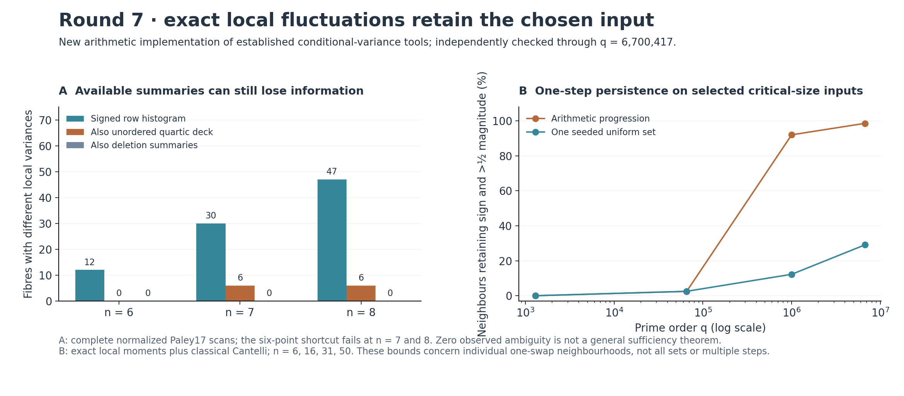

# Round 7: exact fluctuations around a chosen arithmetic input

The completed tool computes exact means and variances over all one-point edits of a specified Paley set. It preserves correlations discarded by global and row-wise summaries. Two implementations agree through q=6,700,417,n=50, where each query covers335,018,350 neighbouring sets without evaluating those targets individually.

The strongest new finite information-loss result uses seven-point sets with the same complete signed row histogram and the same unordered list of every quartic correlation. They also have the same T6 and the same average swap behavior. Their local variances differ by512/35. A corresponding eight-point witness differs by64/9. The initial six-point example was too weak: its variance ambiguity disappeared when the already available quartic deck was retained. The n=7 and8 tests avoid that shortcut.

The retained object is an internal matrix `V[a,b]=sum_x S[x,b]*e5(S[x,C without a])`, for a,b in C, together with derivative sums and norms. The standard conference identity sums the squared insertion transform over the whole field. V removes the forbidden insertion points exactly. This yields the variance over all n(q-n) actual swaps. The independent backend uses synthetic polynomial division and symmetric weighted Gram matrices; its largest saved queries took37–43 seconds on the shared machine. This is an implemented arithmetic interface based on established mathematics, with no claim of historical uniqueness.

A usable [query command](local_edits/query.py) returns exact rational moments, optionally the full contraction record, and exact finite one-sided bounds using classical Cantelli. For C={0,...,49} at q=6,700,417, at least330,335,111 of335,018,350 neighbours retain T6's negative sign and more than half its magnitude. This is an input-specific one-step statement. It neither controls every input nor overcomes the previous thin-shell persistence obstruction.

The validation includes9,373 normalized Paley17 sets checked against660,660 direct neighbour values;120 separate degree/boundary cases;7,506 large internal entries and206 derivative sums/norms compared across implementations; a literal readback of ten witness sets; and8,298 finite-distribution threshold checks. Details, exact fractions, reproduction commands and limitations are in the [tool report](local_edits/README.md), [independent verification](local_edits/verification.json) and [integration manifest](manifest.json).

A final control rejects an overinterpretation of the best tiny summary. At n=6 and8, the summary identifies the full set up to square-affine symmetry, so its apparent sufficiency is automatic on that domain. At n=7, two summary fibres join non-affine sets. Direct review finds that each pair even has the same complete one-swap T6 histogram, not merely the same first two moments. Raising the order of an unlabelled one-step moment would therefore fail to separate those pairs. The [Burnside and literal-feature review](local_edits/orbit_verification.json) records the complete evidence.

This points the next experiment toward **correlations between edits sharing the same inserted point**, or toward multi-step geometry. Another unlabelled local moment would repeat the information loss on the residual pairs. The [live plan](../NEXT_ITERATION.md) gives a concrete covariance identity for the next prototype. Local variance, exchangeable pairs, the conference identity and orbit auditing all have prior art; the [source audit](local_edits/prior_art.md) specifies the local contribution and search boundary.
