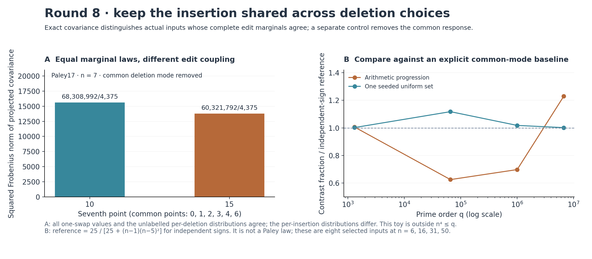

# Round 8: preserve how edits share an inserted point

This completed iteration builds an exact covariance tool for different deletion choices under a common insertion. It separates actual Paley inputs whose complete one-swap distributions agree, including their unlabelled collections of per-deletion distributions. The difference survives removal of the common deletion mode.

For the seven-point sets `{0,1,2,3,4,6,10}` and `{0,1,2,3,4,6,15}` in F17, every moment of the flattened one-swap distribution is identical. Their diagonal covariance multisets, total covariance and covariance traces also agree. However, the squared Frobenius norms after projection off the common deletion mode are68308992/4375 and60321792/4375. A second non-affine pair has the same separation. The missing information is which edits share an insertion coordinate.

The [tool report](shared_insertions/README.md) derives the exact identity. The new retained matrix is the Gram matrix of the deletion derivatives. Together with the previous internal transform, it yields the full covariance without evaluating every neighbouring target. A C++ row-streaming backend extends the computation to q=6,700,417,n=50 in about25–32 seconds on the saved runs. Each input has335,018,350 one-swap neighbours. A [query command](shared_insertions/query_covariance.py) returns exact fractions and optionally the full covariance and contrast certificates.

A normalization control prevents a misleading interpretation. The response common to all deletion choices dominates raw covariance on the larger inputs. The tool projects that mode out and compares the remaining energy fraction with an exact independent-sign reference, `25/[25+(n-1)(n-5)^2]`. This reference is not a conference-matrix construction or a Paley asymptotic. The largest saved progression has1.2294 times the reference fraction; the single seeded input has1.0018 times it. These are finite diagnostics, not a classification or uniform estimate.

The [independent coverage](shared_insertions/verification.json) is explicit: all584 new Gram entries through q=65,537,48 selected larger off-diagonal entries, all206 Gram row sums, and the derivative identity on15,534,568 field rows. A separate [degree/boundary review](shared_insertions/boundary_verification.json) checks33,480 covariance entries across25 cases, including an actual maximal-coefficient64-point row. [Affine and coupling controls](shared_insertions/coupling_verification.json) check392 covariance entries and196 literal projected entries. The largest new Gram matrices were not wholly recomputed by a second implementation.

The [integration manifest](manifest.json) binds the completed sources and outputs and preserves all round7 artifacts. The [prior-art note](shared_insertions/prior_art.md) identifies established covariance, contraction, coupling and projection machinery. The contribution is the precise arithmetic implementation and finite information-loss witnesses; historical uniqueness is unestablished. No proof of either prize is attempted.

The next experiment should test how this retained coupling relates to actual multi-step edit behavior, and audit the analogous loss of coordinate incidence in the coding support tools. The [live plan](../NEXT_ITERATION.md) preserves those questions without claiming an unproved bridge.
