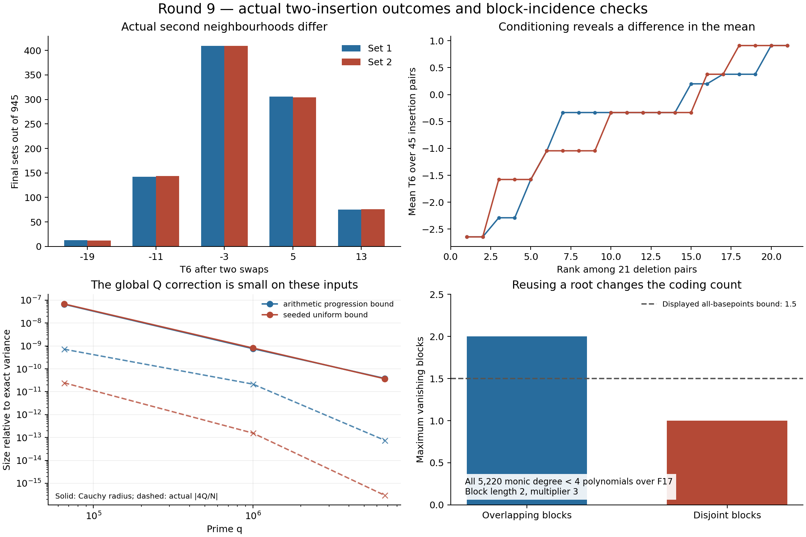

# Round9: actual two-insertion outcomes

The new query computes exact first and second moments after deleting a chosen pair from an actual Paley input and inserting two distinct outside points. It reaches q=6,700,417,n=50, representing22,447,455,617,161 distinct final sets per chosen deletion pair. It uses a row pass, selected matrix entries and exact character convolution; it does not enumerate those final sets.

The main finite finding is more specific than another moment calculation. The two non-affine twin pairs saved in [round8](../round8/README.md) share their complete one-swap distributions. Their two-swap distributions differ. Their global two-swap means and variances still agree, but the collections of means and variances **conditioned on the deletion pair** differ. Thus retaining the deletion choice matters even at first order. No uniform Paley bound or prize proof follows.



For the first twin pair at q17,n7, every complete two-swap shell has945 sets:

| T6 value | −19 | −11 | −3 | 5 | 13 |
|---|---:|---:|---:|---:|---:|
| C={0,1,2,3,4,6,10} |13|142|409|306|75|
| C={0,1,2,3,4,6,15} |12|144|409|304|76|

Both variances are1,595,392/33,075. The full third moments about the mean differ. Each of the21 deletion pairs has45 possible insertion pairs; already its mean collection separates the two inputs. [twin_analysis.json](twin_analysis.json) includes both pairs and the exact distributions.

## Query and implementation

```
c++ -O3 -std=c++17 tooling_lab/round9/two_insertions_backend.cpp -o tooling_lab/round9/two_insertions_backend
python tooling_lab/round9/two_insertions.py 17 --selected 0 1 2 3 4 6 10 --deleted 0 1
```

[two_insertions.py](two_insertions.py) exports `query(q, selected, deleted, degree=6)` and a small `from_matrix` adapter. The returned object includes exact integer statistics, rational mean/variance, the insertion-pair count and an exact Cauchy envelope for the only global bilinear term. The prime query requires q≡1 mod4, q≤10million, n≤64, at least two outside points, and degree0 through6. The matrix adapter validates balanced conference identities and is limited to order257. [DERIVATION.md](DERIVATION.md) gives the complete formulas, diagonal exclusions, integer bounds and CRT argument.

If g=e5(S[:,C\{a,c}]) and h=e4(S[:,C\{a,c}]), the global term is Q=gᵀSh and its coefficient in the variance is4/[(q−n)(q−n−1)]. Both arithmetic-progressions and the frozen seeded inputs were tested at q1297,65537,1000033 and6700417. The largest variance is about2.04815×10¹³ for the progression and2.42984×10¹³ for the seeded input. The respective Q corrections are about−1.55614 and0.00727290. Even the rigorous Cauchy radius is less than3.84×10⁻¹¹ of the exact variance in both largest cases.

This weakens the case for studying that contraction as a dominant variance obstruction on these inputs. It does **not** make Q identically zero or allow it to be omitted from an exact query. The first moment needs no Q; compiling all deletion-pair means is a better next candidate. These are chosen-input observations, not uniform or asymptotic claims. The final largest producer runs took 23.6 and 27.8 seconds on the shared machine; these are reproducibility observations, not a controlled speed comparison.

## Verification coverage

- Literal subset products check99 boundary cases and both complete twin shells:9,618 distinct insertion-pair evaluations total.
- A separate coefficient-count and dense-matrix implementation checks 42 backend cases, 34,508 scalar statistics, 7 rejected invalid queries and 3 rejected invalid matrices. It includes all degrees and a 64-point selected-set boundary.
- The older general marked-moment compiler agrees on four cases using16 conditioning queries with inclusion-exclusion. Twenty-one affine controls cover degrees0 through6.
- A separate C++ transform implementation reconstructs **all eight Q scalars exactly**, using coefficient counts, the opposite transform pairing and three-prime CRT. This is a full scalar verification, not a modular sample.
- Independent blockwise review recomputes every selected g,h,f,v,w entry and every row scalar total. It recomputes all314 upper-triangular K entries in the four cases through q65537. It checks12 off-diagonal K entries in each of the four larger cases,48 total. The largest new K matrices have **partial independent readback**, not a full second computation.

These are separate arithmetic implementations run by the root agent after the child agents failed with service errors. They are not human refereeing or new Lean certification. [scale_verification.json](scale_verification.json) records the coverage; [manifest.json](manifest.json) binds the completed artifacts and preserves round8.

## Coding lane

The [coding transfer audit](coding_audit.md) implements exact evaluation-kernel incidence checks and exhausts5,220 monic polynomials over F17. It finds a counterexample to the all-basepoints inequality displayed in Lemma4.1 of a January2026 preprint: two overlapping blocks share one root and exceed the displayed1.5 bound. The disjoint-block control satisfies it. This concerns the displayed lemma's scope, not the main theorem's status. It also demonstrates why an ordinary scalar Reed–Solomon observation map cannot simply inherit folded-code dimension parameters.

The useful direction is to account explicitly for reused coordinates when adapting cluster methods. The current tool audits hypotheses; it does not remove the previous covering barrier. [prior_art.md](prior_art.md) distinguishes the implementation and finite witnesses from known contractions, conditioning, root counting and subspace designs. Historical originality remains unestablished.

Reproduce the complete round with `preflight.py`, `backend_review.py`, `interoperability_review.py`, `run_scale.py`, compilation of `review_contraction.cpp`, `review_scale.py`, `analyze_twins.py`, `coding_block_audit.py`, `plot_results.py`, and `verify_round.py`, in that dependency order. Use `/opt/miniconda3/bin/python3` on this machine. Earlier snapshots and both prize proof cones remain unchanged by this round.
